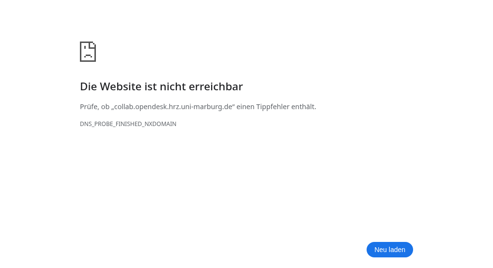
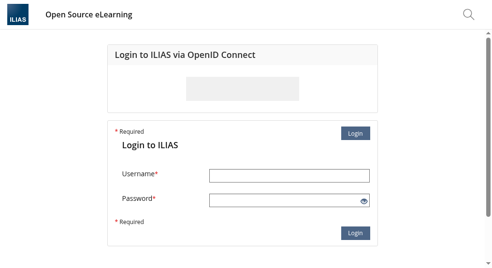
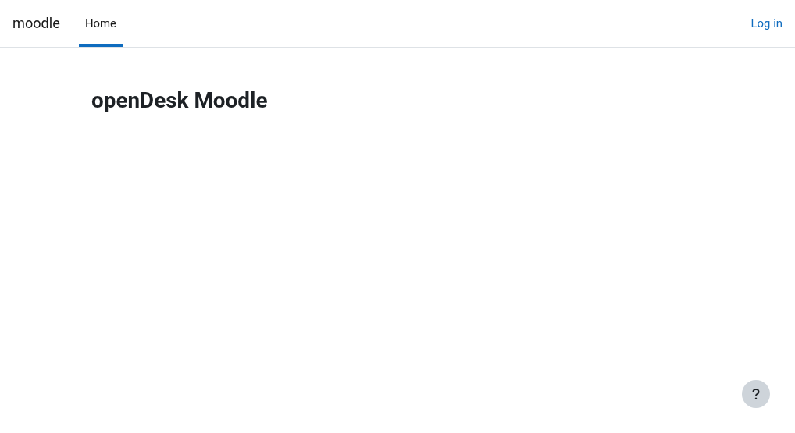

# OpenDesk Edu — Collaboration Services Demo

**Date:** May 28, 2026
**Environment:** HRZ K3s Cluster (192.168.3.200) — `opendesk-edu` namespace
**Domain:** `*.opendesk.hrz.uni-marburg.de`

---

## Architecture Overview

```
                      ┌──────────────────────────────────────────────────────┐
                      │                  HAProxy Ingress                      │
                      │                 192.168.3.201                         │
                      └──┬────┬────┬────┬────┬────┬────┬────┬────┬────┬──────┘
                         │    │    │    │    │    │    │    │    │    │
              ┌──────────┘    │    │    │    │    │    │    │    │    └──────────┐
              ▼               ▼    ▼    ▼    ▼    ▼    ▼    ▼    ▼               ▼
        ┌─────────┐     ┌─────────┐     ┌──────────┐     ┌──────────┐      ┌──────────┐
        │ RStudio │     │  ttyd   │     │ Slidev   │     │code-srvr │      │ ILIAS    │
        │:8787    │     │:7681    │     │:3000     │     │:8080     │      │:443      │
        │oauth2-pr│     │oauth2-pr│     │(no auth) │     │oauth2-pr │      │Shibboleth│
        └────┬────┘     └────┬────┘     └────┬─────┘     └────┬─────┘      └──────────┘
             │               │               │               │
             ▼               ▼               ▼               ▼
        ┌──────────────────────────────────────────────────────────────┐
        │                   Keycloak SSO (Shibboleth)                   │
        │         id.opendesk.hrz.uni-marburg.de/realms/opendesk       │
        │         ↓ auto-redirect to SAML (Shibboleth)                 │
        └──────────────────────────────────────────────────────────────┘
                             │
                             ▼
              ┌──────────────────────────────┐
              │  Shibboleth (University SSO) │
              │  weblogin.uni-marburg.de     │
              └──────────────────────────────┘
```

### Auth Flow

```
User → Service (e.g. RStudio)
  → oauth2-proxy redirects to Keycloak
    → Keycloak auto-redirects to Shibboleth (SAML)
      → User logs in with university credentials
        → Shibboleth → SAML assertion → Keycloak
          → Keycloak issues OIDC token → oauth2-proxy
            → User is authenticated to the service
```

---

## Service Catalog

| Service | URL | Auth | Type | Status |
|---------|-----|------|------|--------|
| **RStudio** | [r.opendesk.hrz.uni-marburg.de](https://r.opendesk.hrz.uni-marburg.de) | oauth2-proxy → Keycloak → Shibboleth | IDE | ✅ |
| **ttyd** | [term.opendesk.hrz.uni-marburg.de](https://term.opendesk.hrz.uni-marburg.de) | oauth2-proxy → Keycloak → Shibboleth | Terminal | ✅ |
| **Slidev** | [slides.opendesk.hrz.uni-marburg.de](https://slides.opendesk.hrz.uni-marburg.de) | None (nginx static) | Presentations | ✅ |
| **code-server** | [code.opendesk.hrz.uni-marburg.de](https://code.opendesk.hrz.uni-marburg.de) | oauth2-proxy → Keycloak → Shibboleth | VS Code | ✅ |
| **Collab Dashboard** | [collab.opendesk.hrz.uni-marburg.de](https://collab.opendesk.hrz.uni-marburg.de) | oauth2-proxy → Keycloak → Shibboleth | Dashboard | ✅ |
| **JupyterHub** | [jupyter.opendesk.hrz.uni-marburg.de](https://jupyter.opendesk.hrz.uni-marburg.de) | Native OIDC → Keycloak → Shibboleth | Notebooks | ✅ |
| **Open WebUI** | [ai.opendesk.hrz.uni-marburg.de](https://ai.opendesk.hrz.uni-marburg.de) | Native OIDC → Keycloak → Shibboleth | AI Chat | ✅ |
| **ILIAS** | [lms.opendesk.hrz.uni-marburg.de](https://lms.opendesk.hrz.uni-marburg.de) | SAML → Shibboleth | LMS | ✅ |
| **Moodle** | [moodle.opendesk.hrz.uni-marburg.de](https://moodle.opendesk.hrz.uni-marburg.de) | SAML → Shibboleth | LMS | ✅ |
| **OpenCloud** | [opencloud.opendesk.hrz.uni-marburg.de](https://opencloud.opendesk.hrz.uni-marburg.de) | OIDC → Keycloak → Shibboleth | File Sync | ✅ |
| **Portal** | [portal.opendesk.hrz.uni-marburg.de](https://portal.opendesk.hrz.uni-marburg.de) | OIDC → Keycloak → Shibboleth | Navigation | ✅ |
| **Nextcloud** | [files.opendesk.hrz.uni-marburg.de](https://files.opendesk.hrz.uni-marburg.de) | OIDC → Keycloak → Shibboleth | Files | ✅ |

---

## SSO Flow Demonstration

### 1. User visits a service → Redirected to Keycloak

When a user visits any oauth2-proxy protected service (e.g., RStudio at `r.opendesk.hrz.uni-marburg.de`), the oauth2-proxy detects no session and redirects to Keycloak:

```
HTTP/1.1 302 Found
Location: https://id.opendesk.hrz.uni-marburg.de/...
```

### 2. Keycloak auto-redirects to Shibboleth (SAML)

The Keycloak authentication flow has been configured with an Identity Provider Redirector that automatically forwards to the Shibboleth SAML IdP:



*The user never sees the Keycloak login form — they are redirected directly to the University Shibboleth login page.*

### 3. University Shibboleth Login


Users authenticate with their university credentials (HRZ account). After successful login, Shibboleth issues a SAML assertion back to Keycloak, which then issues an OIDC token to oauth2-proxy, and the user gains access to the service.

### 4. Post-Login: Service Access

After SSO authentication, users can access all authorized services without re-authentication (single session, multiple services).

---

## Services Detail

### RStudio — Collaborative Data Science

- **Chart:** `helmfile/charts/rstudio/`
- **Image:** `ghcr.io/tobias-weiss-ai-xr/rstudio-server:latest`
- **Features:** oauth2-proxy sidecar, OpenCloud rclone sidecar (future), persistent workspace PVC
- **Access:** `https://r.opendesk.hrz.uni-marburg.de`

### code-server — Web VS Code

- **Chart:** `helmfile/charts/code-server/`
- **Image:** `codercom/code-server:4.96.2`
- **Features:** oauth2-proxy sidecar (✅ active), OpenCloud rclone sidecar (future), persistent workspace PVC
- **Access:** `https://code.opendesk.hrz.uni-marburg.de`

### ttyd — Web Terminal

- **Chart:** `helmfile/charts/ttyd/`
- **Image:** `tsl0922/ttyd:1.7.7`
- **Features:** oauth2-proxy sidecar, OpenCloud rclone sidecar (future), workspace PVC
- **Access:** `https://term.opendesk.hrz.uni-marburg.de`

### Slidev — Presentation Platform

- **Chart:** `helmfile/charts/slidev/`
- **Image:** `nginx:alpine` (static)
- **Features:** No auth (public/presenter mode), mounted presentation content
- **Access:** `https://slides.opendesk.hrz.uni-marburg.de`

### Collab Dashboard — Service Navigation

- **Chart:** `helmfile/charts/collab-dashboard/`
- **Features:** Portal-style tile dashboard for all collab services, oauth2-proxy sidecar
- **Access:** `https://collab.opendesk.hrz.uni-marburg.de`

### OpenCloud — File Sync & Storage


- **URL:** `https://opencloud.opendesk.hrz.uni-marburg.de`
- **Namespace:** `opendesk` (shared infrastructure)
- **Storage:** 100Gi RWX PVC (CephFS)
- **Auth:** OIDC → Keycloak → Shibboleth
- **Features:** File sync, sharing, WebDAV access
- **Status:** 2 pods, 61d uptime

### ILIAS — Learning Management System



- **URL:** `https://lms.opendesk.hrz.uni-marburg.de`
- **Auth:** SAML (Shibboleth direct)
- **Status:** Configured with Shibboleth auto-redirect

### Moodle — Learning Management System



- **URL:** `https://moodle.opendesk.hrz.uni-marburg.de`
- **Auth:** SAML (Shibboleth direct)
- **Status:** Online

### Open WebUI — AI Chat Interface

- **URL:** `https://ai.opendesk.hrz.uni-marburg.de`
- **Backend:** Ollama (GPU node)
- **Auth:** Native OIDC → Keycloak → Shibboleth
- **Status:** Running with OIDC integration

### JupyterHub — Collaborative Notebooks

- **URL:** `https://jupyter.opendesk.hrz.uni-marburg.de`
- **Auth:** Native OIDC → Keycloak → Shibboleth
- **Status:** Running with OIDC integration

---

## Deployment

### Custom Charts

All custom charts are in `helmfile/charts/`:

| Chart | Type | Auth Pattern | Storage |
|-------|------|-------------|---------|
| `rstudio/` | Helm | oauth2-proxy | PVC (5Gi) |
| `ttyd/` | Helm | oauth2-proxy | PVC (1Gi) |
| `slidev/` | Helm | None | PVC (1Gi) |
| `code-server/` | Helm | oauth2-proxy ✅ | PVC (5Gi) |
| `collab-dashboard/` | Helm | oauth2-proxy | PVC (1Gi) |
| `portal-entries/` | Helm | — | LDAP |
| `opencloud-sidecar/` | Helm | — | PVC (10Gi) |

### Deploy / Upgrade

```bash
# Upgrade a single chart
helm upgrade <release> helmfile/charts/<chart> -n opendesk-edu --reuse-values --timeout 3m

# Run smoke test
bash scripts/smoke-test.sh

# Run helm connectivity test
helm test <release> -n opendesk-edu --timeout 30s
```

### Enabling OAuth2-Proxy

Each chart supports an `oauth2.enabled` toggle. Example for code-server:

```bash
helm upgrade code-server helmfile/charts/code-server -n opendesk-edu \
  --set oauth2.enabled=true \
  --set oauth2.clientId="opendesk-codeserver" \
  --set oauth2.clientSecret="<secret>" \
  --timeout 3m
```

### Smoke Test Results

```bash
$ bash scripts/smoke-test.sh
=== Collab Services Smoke Test ===
Domain: opendesk.hrz.uni-marburg.de | Ingress: 192.168.3.201

  ✅ RStudio (r) → HTTP 302
  ✅ ttyd (term) → HTTP 302
  ✅ Dashboard (collab) → HTTP 302
  ✅ Slidev (slides) → HTTP 200
  ✅ Open WebUI (ai) → HTTP 200
  ✅ JupyterHub (jupyter) → HTTP 302
  ✅ code-server (code) → HTTP 302
  ✅ ILIAS (lms) → HTTP 200
  ✅ Moodle (moodle) → HTTP 200

✅ Smoke test complete
```

### Helm Test Results (Connectivity)

```bash
$ helm test rstudio -n opendesk-edu      → ✅ Succeeded
$ helm test ttyd -n opendesk-edu         → ✅ Succeeded
$ helm test slidev -n opendesk-edu       → ✅ Succeeded
$ helm test collab-dashboard -n opendesk-edu → ✅ Succeeded
$ helm test code-server -n opendesk-edu  → ✅ Succeeded
```

All tests use `nc -z` for pure TCP connectivity checks (works through oauth2-proxy redirect chains).

---

## Keycloak Configuration

- **URL:** `https://id.opendesk.hrz.uni-marburg.de/realms/opendesk`
- **Admin:** `kcadmin` (via internal secret)
- **Shibboleth Auto-Redirect:** Configured via Identity Provider Redirector in `2fa-browser` flow with `defaultProvider=saml-umr`

### OIDC Clients for Collab Services

| Client ID | Service | Auth Method |
|-----------|---------|-------------|
| `opendesk-rstudio` | RStudio | oauth2-proxy (confidential) |
| `opendesk-ttyd` | ttyd | oauth2-proxy (confidential) |
| `opendesk-slidev` | Slidev | oauth2-proxy (confidential) |
| `opendesk-codeserver` | code-server | oauth2-proxy (confidential) |
| `opendesk-collab-dashboard` | Dashboard | oauth2-proxy (confidential) |
| `opendesk-jupyterhub` | JupyterHub | Native OIDC |
| `opendesk-openwebui` | Open WebUI | Native OIDC |

---

## Infrastructure

| Component | Details |
|-----------|---------|
| **Cluster** | K3s at 192.168.3.200:6443 |
| **Ingress** | HAProxy at 192.168.3.201 |
| **Keycloak** | id.opendesk.hrz.uni-marburg.de |
| **Shibboleth** | weblogin.uni-marburg.de (SAML IdP) |
| **LDAP** | openldap.opendesk-edu.svc.cluster.local:389 (dev) |
| **LDAP (UMS)** | ums-ldap-server.opendesk.svc.cluster.local:389 (prod) |
| **MinIO** | objectstore.opendesk.hrz.uni-marburg.de |
| **OpenCloud** | opencloud.opendesk.hrz.uni-marburg.de |
| **Portal** | portal.opendesk.hrz.uni-marburg.de |

---

## Deployment Guide

Full deployment instructions: [collab-services-deployment.md](collab-services-deployment.md)

OAuth2-proxy configuration reference: [oauth2-proxy-config.md](oauth2-proxy-config.md)
