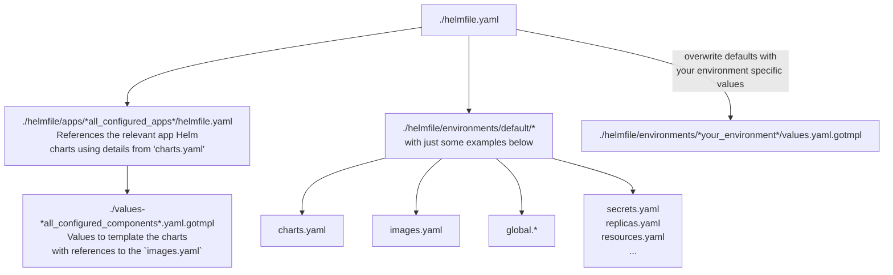

<!--
SPDX-FileCopyrightText: 2023 Bundesministerium des Innern und für Heimat, PG ZenDiS "Projektgruppe für Aufbau ZenDiS"
SPDX-License-Identifier: Apache-2.0
-->

<h1>Developing openDesk deployment automation</h1>

Active development on the deployment is currently only available for project members.
But contributions will be possible soon once the CLA process is sorted out.

* [Overview](#overview)
* [Default branch, `develop` and other branches](#default-branch-develop-and-other-branches)
* [External artefacts - `charts.yaml` and `images.yaml`](#external-artefacts---chartsyaml-and-imagesyaml)
  * [Linting](#linting)
  * [Renovate](#renovate)
  * [Mirroring](#mirroring)
    * [Get new artefacts mirrored](#get-new-artefacts-mirrored)
  * [Release-Artefacts](#release-artefacts)
* [Creating new charts / images](#creating-new-charts--images)

# Overview

The following sketch provides an high level overview to get a basic understanding of the deployment relevant
structure of this repository. An understanding of that structure is vital if you want to contribute to
the development of the deployment automation of openDesk.



The `helmfile.yaml` in the root folder is the basis for the whole deployment. It references the app specific `helmfile.yaml` files as well as some
global values files in `./environments/default`. It allows you to overwrite defaults by using one of the three predefined environments `dev`, `test`
and `prod`.

Before you look into any app specifc configuration it is recommended to review the contents of `./environments/default` to get an understanding of what
details are maintained in there, as they are usually referenced by the app configurations.

# Default branch, `develop` and other branches

The `main` branch is configured to be the default branch, as visitors of the project on Open CoDE should see that
branch by default.

Please use the `develop` branch to diverge your own branch(es) from. See the [workflow guide](./workflow.md)
for more details on naming conventions.

There is a CI bot that automatically creates a merge request once you initially pushed your branch to Open CoDE.
The merge request will of course target the `develop` branch, be in status `draft` and have you as assignee.

In case you do not plan to actually merge from the branch you have pushed, please close or delete the autocreated MR.

# External artefacts - `charts.yaml` and `images.yaml`

The `charts.yaml` and `images.yaml` are the central place to reference external artefacts that are used for the deployment.

Beside the deployment automation itself various tools work with the contents of the files:

- **Linting**: Ensures consistency of the file contents for the other tools.
- **Renovate**: Automatically create MRs that update the components to their latest version.
- **Mirror**: Mirror artefacts to Open CoDE.
- **Release-Artefacts**: Creates the release asset jsons.

Please find details on these tools below.

## Linting

In the project's CI there is a step dedicated to lint the two yaml files, as we want them to be in
- alphabetical order regarding the components and
- in a logical order regarding the non-commented lines (registry > repository > tag).

In the linting step the [openDesk CI CLI](https://gitlab.opencode.de/bmi/opendesk/tooling/opendesk-ci-cli) is used to apply the
just mentioned sorting and the result is compared with the unsorted version. If there is a delta the linting fails and you probably
want to fix it by running the CLI tool locally.

**Note**: Please ensure that in component blocks you use comments only at the beginning of the block or at its end. Ideally you just stick
with the many available examples in the yaml files.

Example:
```
  synapse:
    # providerCategory: 'Supplier'
    # providerResponsible: 'Element'
    # upstreamRegistry: 'registry-1.docker.io'
    # upstreamRepository: 'matrixdotorg/synapse'
    # upstreamMirrorTagFilterRegEx: '^v(\d+)\.(\d+)\.(\d+)$'
    # upstreamMirrorStartFrom: ['1', '91', '2']
    registry: "registry.opencode.de"
    repository: "bmi/opendesk/components/supplier/element/images-mirror/synapse"
    tag: "v1.91.2@sha256:1d19508db417bb2b911c8e086bd3dc3b719ee75c6f6194d58af59b4c32b11322"
```

## Renovate

- See also: https://gitlab.opencode.de/bmi/opendesk/tooling/renovate-opencode

Uses a regular expression to match the values of the attributes
- `# upstreamRegistry`
- `# upstreamRepository`
- `tag`
check for newer versions of the given artefact and create a MR containing the newest version's tag (and digest).

## Mirroring

- See also: https://gitlab.opencode.de/bmi/opendesk/tooling/oci-pull-mirror

**Note:** The mirror is scheduled to run every hour at 42 minutes past the hour.

openDesk strives to make all relevant artefacts available on Open CoDE so there is the mirroring process
configured to pull artefacts that do not originate from Open CoDE into projects called `*-Mirror` within the
[openDesk Components section](https://gitlab.opencode.de/bmi/opendesk/components).

The mirror script takes the information on what artefacts to mirror from the annotation inside the two yaml files:
- `# upstreamRegistry` *required*: To identify the source registry
- `# upstreamRepository` *required*: To identify the source repository
- `# upstreamMirrorTagFilterRegEx` *required*: If this annotation is set it activates the mirror for the component. Only tags are being mirrored that match the given regular expression.
- `# upstreamMirrorStartFrom` *optional*: Array of numeric values in case you want to mirror only artefacts beginning with a specific version. You must use capturing groups
  in `# upstreamMirrorTagFilterRegEx` to identify the single numeric elements of the version within the tag and use per capturing group (left to right) one numeric array
  element here to define the version the mirror should start with.

### Get new artefacts mirrored

If you want new images or charts to be mirrored that are not yet included in one of the yaml files there are two options:

You include them in your branch with all required annotations and either
1. ask somebody from the platform development team to trigger the mirror's CI based on your branch or
2. you get your branch merged to `develop` already.

## Release-Artefacts

- See also: https://gitlab.opencode.de/bmi/opendesk/tooling/opendesk-asset-generator

Creates the two artefacts `image-index.json` and `chart-index.json` by parsing the yaml files and combining the artefact's details:
- `registry`
- `repository`
- `tag` in the images file or `name` & `version` in the charts file.
adding the provider information from the annotations
- `# providerCategory`
- `# providerResponsible`

# Creating new charts / images

When you create new Helm charts please check out the
[openDesk Best Practises](https://gitlab.opencode.de/bmi/opendesk/components/platform-development/charts/opendesk-best-practises)
for Helm charts.

You may also want to make use of our [standard CI](https://gitlab.opencode.de/bmi/opendesk/tooling/gitlab-config) to
easily get Charts and Images that are signed, linted, scanned and released.
Check out the `.gitlab-ci.yaml` files in the project's [Charts](https://gitlab.opencode.de/bmi/opendesk/components/platform-development/charts) or [Images](https://gitlab.opencode.de/bmi/opendesk/components/platform-development/images) to get an idea how little you need to do yourself.
