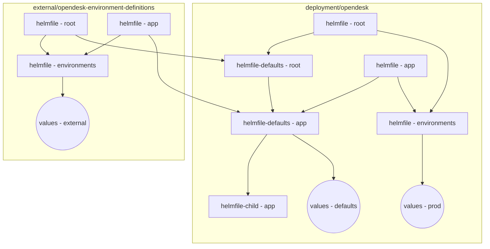

<!--
SPDX-FileCopyrightText: 2024-2026 Zentrum für Digitale Souveränität der Öffentlichen Verwaltung (ZenDiS) GmbH
SPDX-License-Identifier: Apache-2.0
-->

# Migration requirements

> [!note]
> openDesk's latest migration documentation is split across two documents:
>
> - This document covers the **manual checks and actions** for at least the last two openDesk releases on [the mandatory upgrade path](#overview-and-mandatory-upgrade-path).
> - [`migrations-automated.md`](./migrations-automated.md) covers the **automated migrations**, which openDesk runs on
>   its own as part of every deployment, and the catalogue of the available actions.
>
> New options made available with a release that do not require manual interaction are documented in [`updates.md`](./updates.md)
>
> Manual checks and actions for older openDesk release can be found in [`migrations-manual-archive.md`](./migrations-manual-archive.md).

> [!important]
> Please read and follow these requirements thoroughly before starting an update or upgrade. Always run your backup procedure before beginning an upgrade, as rollbacks may require restoring from backup due to non-reversible database changes within the applications.

> [!warning]
> Depending on your PV reclaim policy, you may need to clean up PVs manually once the related PVCs are no longer in use.

<!-- TOC -->
* [Migration requirements](#migration-requirements)
  * [Deprecation warnings](#deprecation-warnings)
  * [Overview and mandatory upgrade path](#overview-and-mandatory-upgrade-path)
  * [Manual checks/actions](#manual-checksactions)
    * [Versions ≥ v1.17.0](#versions--v1170)
      * [Pre-upgrade to versions ≥ v1.17.0](#pre-upgrade-to-versions--v1170)
        * [Fixed Helmfile templating: `loadBalancerIP` for Dovecot and Postfix services](#fixed-helmfile-templating-loadbalancerip-for-dovecot-and-postfix-services)
        * [Postfix: Changed network settings to list](#postfix-changed-network-settings-to-list)
        * [Changed Helmfile structure: Allow overriding app helmfiles and consolidate helmfile environment definitions](#changed-helmfile-structure-allow-overriding-app-helmfiles-and-consolidate-helmfile-environment-definitions)
        * [Changed Helmfile structure: Limited support for existing secrets](#changed-helmfile-structure-limited-support-for-existing-secrets)
          * [Structure of secret definitions](#structure-of-secret-definitions)
          * [Secrets consolidated into their domain files and a consistent `value` structure](#secrets-consolidated-into-their-domain-files-and-a-consistent-value-structure)
      * [Post-upgrade to versions ≥ v1.17.0](#post-upgrade-to-versions--v1170)
        * [Backup of the migration status](#backup-of-the-migration-status)
    * [Versions ≥ v1.16.0](#versions--v1160)
      * [Pre-upgrade to versions ≥ v1.16.0](#pre-upgrade-to-versions--v1160)
        * [Nubus bug fix: LDAP storage class settings](#nubus-bug-fix-ldap-storage-class-settings)
    * [Versions ≥ v1.15.0](#versions--v1150)
      * [Pre-upgrade to versions ≥ v1.15.0](#pre-upgrade-to-versions--v1150)
        * [New Helmfile default: external mail services are no longer enabled by default](#new-helmfile-default-external-mail-services-are-no-longer-enabled-by-default)
        * [New Helmfile default: Support for SeaweedFS as S3 backend](#new-helmfile-default-support-for-seaweedfs-as-s3-backend)
      * [Post-upgrade to versions ≥ v1.15.0](#post-upgrade-to-versions--v1150)
        * [XWiki bug fix: LDAP group synchronization incomplete](#xwiki-bug-fix-ldap-group-synchronization-incomplete)
        * [XWiki bug fix: User account merge for uppercase usernames (Part 2)](#xwiki-bug-fix-user-account-merge-for-uppercase-usernames-part-2)
    * [Versions ≥ v1.14.0](#versions--v1140)
      * [Pre-upgrade to versions ≥ v1.14.0](#pre-upgrade-to-versions--v1140)
        * [Updated Helmfile behaviour: Remove default MASTER\_PASSWORD](#updated-helmfile-behaviour-remove-default-master_password)
        * [Changed Helmfile structure: Custom OIDC clients and client scopes](#changed-helmfile-structure-custom-oidc-clients-and-client-scopes)
        * [Changed Helmfile structure: Single-sign on federation with upstream IdPs](#changed-helmfile-structure-single-sign-on-federation-with-upstream-idps)
      * [Post-upgrade to versions ≥ v1.14.0](#post-upgrade-to-versions--v1140)
        * [Potential restart: OX Connector may get into crash loop](#potential-restart-ox-connector-may-get-into-crash-loop)
    * [Versions ≥ v1.13.0](#versions--v1130)
      * [Pre-upgrade to versions ≥ v1.13.0](#pre-upgrade-to-versions--v1130)
        * [New Helmfile default: Support for Ingress controller `haproxy-ingress.github.io`](#new-helmfile-default-support-for-ingress-controller-haproxy-ingressgithubio)
        * [Updated Helmfile options: New ingress additional annotations](#updated-helmfile-options-new-ingress-additional-annotations)
    * [Versions ≥ v1.12.0](#versions--v1120)
      * [Pre-upgrade to versions ≥ v1.12.0](#pre-upgrade-to-versions--v1120)
        * [New application default: Keycloak imports users to its own database](#new-application-default-keycloak-imports-users-to-its-own-database)
        * [Replace Helm chart: Upgrade to upstream Jitsi 2.x Helm chart](#replace-helm-chart-upgrade-to-upstream-jitsi-2x-helm-chart)
        * [Fixed Helmfile templating: StorageClassNames for Nubus, OpenProject and OX-Connector](#fixed-helmfile-templating-storageclassnames-for-nubus-openproject-and-ox-connector)
        * [New Helmfile default: Postfix SMTP(D) SASL TLS security options](#new-helmfile-default-postfix-smtpd-sasl-tls-security-options)
      * [Post-upgrade to versions ≥ v1.12.0](#post-upgrade-to-versions--v1120)
        * [Wiki bug fix: User account merge for uppercase usernames](#wiki-bug-fix-user-account-merge-for-uppercase-usernames)
        * [IAM new feature: External routing for mail domains](#iam-new-feature-external-routing-for-mail-domains)
<!-- TOC -->

## Deprecation warnings

We cannot hold back all migrations as some are required e.g. due to a change in a specific component that we want/need to update, we try to bundle others only with major releases.

This section provides an overview of potential changes to be part of the next major release (openDesk 2.0).

- `functional.portal.link*` (see `functional.yaml.gotmpl` for details) are going to be moved into the `theme.*` tree, we are also going to move the icons used for the links currently found under `theme.imagery.portalEntries` in this step.
- We will explicitly set the [database schema configuration](https://www.xwiki.org/xwiki/bin/view/Documentation/AdminGuide/Configuration/#HConfigurethenamesofdatabaseschemas) for XWiki to avoid the use of the `public` schema.
- Removal of the `OPENDESK_1_12_0_SKIP_PVC_MIGRATION` option that was [introduced with openDesk 1.12.0](#fixed-helmfile-templating-storageclassnames-for-nubus-openproject-and-ox-connector).
- Focussing on PostgreSQL all components except OX App Suite components:
  - Removal of the XWiki MariaDB support.
  - Removal of the Nextcloud MariaDB support.
- The option `technical.nubus.keycloak.ldapFederation.importUsers` described in the [≥ 1.12.0 migrations](#new-application-default-keycloak-imports-users-to-its-own-database) is likely to be removed by enforcing the documented change of the user import setting.
- Removal of MinIO as S3 storage backend for non-production installations (see [≥ 1.15.0 migrations](#new-helmfile-default-support-for-seaweedfs-as-s3-backend)).
- Removal of the file `helmfile_generic.yaml.gotmpl`, use `helmfile-defaults.yaml.gotmpl` instead.

## Overview and mandatory upgrade path

The following table gives an overview of the mandatory upgrade path of openDesk, required in order for the automated migrations to work as expected.

To upgrade existing deployments, you _cannot_ skip any version denoted with `yes` in the column
*Mandatory*. This ensures [automated migrations](./migrations-automated.md) have the required previous
state of openDesk. When a version number is not fully defined (e.g. `v1.1.x`), you can install any version
matching that constraint, though our links always point to the newest patch release for that minor version.

> [!warning]
> You must perform **all** manual pre and post upgrade steps for **any** major, minor and patch version up to your desired openDesk version!

> [!note]
> An exemplary update path for an upgrade from v1.3.2 to v1.7.1 would be:
> 1. You are at v1.3.2 → pre steps for v1.4.0 to v1.5.0
> 1. Upgrade to v1.5.0 → post steps for v1.4.0 to v1.5.0
> 1. You are at v1.5.0 → pre steps for v1.6.0 to 1.7.1
> 1. Upgrade to v1.7.1 → post steps for v1.6.0 to v1.7.1

<!-- IMPORTANT: Make sure to mark mandatory releases if an automatic migration requires a previous update to be installed -->
| Version                                                                                   | Mandatory | Pre-Upgrade                                                          | Post-Upgrade                                                           | Minimum Required Previous Version                                                     |
| ----------------------------------------------------------------------------------------- | --------- | -------------------------------------------------------------------- | ---------------------------------------------------------------------- | ------------------------------------------------------------------------------------- |
| [v1.17.0](https://gitlab.opencode.de/bmi/opendesk/deployment/opendesk/-/releases/v1.17.0) | --        | [Pre](#pre-upgrade-to-versions--v1170)                               | [Post](#post-upgrade-to-versions--v1170)                                | ⬇ Install v1.15.x first                                                              |
| [v1.16.x](https://gitlab.opencode.de/bmi/opendesk/deployment/opendesk/-/releases/v1.16.1) | --        | [Pre](#pre-upgrade-to-versions--v1160)                               | --                                                                     | [⚠ Install v1.15.x first](#pre-upgrade-to-versions--v1160)                           |
| [v1.15.x](https://gitlab.opencode.de/bmi/opendesk/deployment/opendesk/-/releases/v1.15.1) | **yes**   | [Pre](#pre-upgrade-to-versions--v1150)                               | [Post](#post-upgrade-to-versions--v1150)                               | ⬇ Install ≥ v1.12.x first                                                            |
| [v1.14.x](https://gitlab.opencode.de/bmi/opendesk/deployment/opendesk/-/releases/v1.14.2) | --        | [Pre](#pre-upgrade-to-versions--v1140)                               | [Post](#post-upgrade-to-versions--v1140)                               | ⬇ Install ≥ v1.12.x first                                                            |
| [v1.13.x](https://gitlab.opencode.de/bmi/opendesk/deployment/opendesk/-/releases/v1.13.2) | --        | [Pre](#pre-upgrade-to-versions--v1130)                               | --                                                                     | [⚠ Install v1.12.x first](#versions--v1120-automated)                                |
| [v1.12.x](https://gitlab.opencode.de/bmi/opendesk/deployment/opendesk/-/releases/v1.12.2) | **yes**   | [Pre](#pre-upgrade-to-versions--v1120)                               | [Post](#post-upgrade-to-versions--v1120)                               | ⬇ Install ≥ v1.8.0 first                                                             |
| [v1.11.x](https://gitlab.opencode.de/bmi/opendesk/deployment/opendesk/-/releases/v1.11.4) | --        | [Pre](./migrations-manual-archive.md#pre-upgrade-to-versions--v1110) | --                                                                     | ⬇ Install ≥ v1.8.0 first                                                             |
| [v1.10.0](https://gitlab.opencode.de/bmi/opendesk/deployment/opendesk/-/releases/v1.10.0) | --        | [Pre](./migrations-manual-archive.md#pre-upgrade-to-versions--v1100) | [Post](./migrations-manual-archive.md#post-upgrade-to-versions--v1100) | ⬇ Install ≥ v1.8.0 first                                                             |
| [v1.9.0](https://gitlab.opencode.de/bmi/opendesk/deployment/opendesk/-/releases/v1.9.0)   | --        | [Pre](./migrations-manual-archive.md#pre-upgrade-to-versions--v190)  | --                                                                     | [⚠ Install v1.8.0 first](./migrations-automated-archive.md#versions--v180-automated) |
| [v1.8.0](https://gitlab.opencode.de/bmi/opendesk/deployment/opendesk/-/releases/v1.8.0)   | **yes**   | [Pre](./migrations-manual-archive.md#pre-upgrade-to-versions--v180)  | --                                                                     | ⬇ Install ≥ v1.5.0 first                                                             |
| [v1.7.x](https://gitlab.opencode.de/bmi/opendesk/deployment/opendesk/-/releases/v1.7.1)   | --        | [Pre](./migrations-manual-archive.md#pre-upgrade-to-versions--v170)  | [Post](./migrations-manual-archive.md#post-upgrade-to-versions--v170)  | ⬇ Install ≥ v1.5.0 first                                                             |
| [v1.6.0](https://gitlab.opencode.de/bmi/opendesk/deployment/opendesk/-/releases/v1.6.0)   | --        | [Pre](./migrations-manual-archive.md#pre-upgrade-to-versions--v160)  | [Post](./migrations-manual-archive.md#post-upgrade-to-versions--v160)  | [⚠ Install v1.5.0 first](./migrations-automated-archive.md#versions--v160-automated) |
| [v1.5.0](https://gitlab.opencode.de/bmi/opendesk/deployment/opendesk/-/releases/v1.5.0)   | **yes**   | --                                                                   | --                                                                     | ⬇ Install ≥ v1.1.x first                                                             |
| [v1.4.x](https://gitlab.opencode.de/bmi/opendesk/deployment/opendesk/-/releases/v1.4.1)   | --        | [Pre](./migrations-manual-archive.md#pre-upgrade-to-versions--v140)  | --                                                                     | ⬇ Install ≥ v1.1.x first                                                             |
| [v1.3.x](https://gitlab.opencode.de/bmi/opendesk/deployment/opendesk/-/releases/v1.3.2)   | --        | [Pre](./migrations-manual-archive.md#pre-upgrade-to-versions--v130)  | --                                                                     | ⬇ Install ≥ v1.1.x first                                                             |
| [v1.2.x](https://gitlab.opencode.de/bmi/opendesk/deployment/opendesk/-/releases/v1.2.1)   | --        | [Pre](./migrations-manual-archive.md#pre-upgrade-to-versions--v120)  | --                                                                     | [⚠ Install v1.1.x first](./migrations-automated-archive.md#versions--v120-automated) |
| [v1.1.x](https://gitlab.opencode.de/bmi/opendesk/deployment/opendesk/-/releases/v1.1.2)   | **yes**   | [Pre](./migrations-manual-archive.md#pre-upgrade-to-versions--v110)  | [Post](./migrations-manual-archive.md#post-upgrade-to-versions--v110)  | [⚠ Install v1.0.0 first](./migrations-automated-archive.md#versions--v110-automated) |
| [v1.0.0](https://gitlab.opencode.de/bmi/opendesk/deployment/opendesk/-/releases/v1.0.0)   | **yes**   | [Pre](./migrations-manual-archive.md#pre-upgrade-to-versions--v100)  | [Post](./migrations-manual-archive.md#post-upgrade-to-versions--v100)  | [⚠ Install v0.9.0 first](./migrations-automated-archive.md#versions--v100-automated) |
| [v0.9.0](https://gitlab.opencode.de/bmi/opendesk/deployment/opendesk/-/releases/v0.9.0)   | **yes**   | --                                                                   | --                                                                     | --                                                                                    |

## Manual checks/actions

> [!note]
> We **only** use the mathematical symbol ≥ to denote for which versions manual steps must be
> applied. For example, "Versions ≥ v1.7.0" refers to all openDesk versions (major, minor and
> patch) starting from 1.7.0, e.g. 1.7.0, 1.7.1, 1.8.0, etc. Furthermore, if a version is not explicitly
> listed no extra manual steps are required when upgrading to that version, e.g. in the case of an update from
> version 1.7.0 to version 1.7.1.

### Versions ≥ v1.17.0

#### Pre-upgrade to versions ≥ v1.17.0

##### Fixed Helmfile templating: `loadBalancerIP` for Dovecot and Postfix services

**Target group:** Deployments that set `service.loadBalancerIp.dovecot` or `service.loadBalancerIp.postfix`.

**Context:**

Until now, the setting `service.loadBalancerIp` was rendered into the Dovecot and Postfix service manifests with an
incorrect field name (`loadBalancerIp` instead of `loadBalancerIP`), so it was silently ignored by Kubernetes and
never had any effect. The templating has been fixed and the setting has been renamed accordingly.

**Required action**

If you configured this setting, rename the key to use an uppercase "P":

```yaml
service:
  loadBalancerIP:
    dovecot: "1.2.3.4"
    postfix: "2.3.4.5"
```

> [!note]
> The assigned load balancer IP of an existing service may change once the setting takes effect for the
> first time.

##### Postfix: Changed network settings to list

**Target group:** Deployments with customized relay net or other networking related settings.

**Context**

All network related settings are using lists now instead of strings.

**Required action: Update all network related settings to lists, including `127.0.0.1/32` and `[::1]/128` if necessary**

Example: Change the customization from a space-separated string:
```yaml
postfix:
  relayNets: "127.0.0.0/8 ::1/128 1.2.3.4/24 2001:d35c:123:4::/64"
```

to a list:
```yaml
postfix:
  relayNets:
    - "127.0.0.0/8"
    - "::1/128"
    - "1.2.3.4/24"
    - "2001:d35c:123:4::/64"
```

##### Changed Helmfile structure: Allow overriding app helmfiles and consolidate helmfile environment definitions

**Target group:** All deployments that deploy single applications or override the helmfiles from another repository

**Context:**

While the helmfile structure already allowed some advanced use cases like referencing the `helmfile_generic.yaml.gotmpl`
file in the root directory of this repository to define your own environments from an external repository, there
were also still some limitations:

- It was not easily possible to reference the `helmfile.yaml.gotmpl` in an application directory, e.g.
  `helmfile/apps/collabora`, to override a single application's default values.

- The helmfile structure forced the maintenance of two files that define helmfile environments, the `helmfile.yaml.gotmpl` in
  the root directory and `environments.yaml.gotmpl` in `helmfile/bases/`.

To solve these problems the helmfile structure was changed by introducing three types of helmfiles:

- `helmfile.yaml.gotmpl`: Entrypoint for helmfile that includes the environments defined in `helmfile/bases/environments.yaml.gotmpl`.

  There is a `helmfile.yaml.gotmpl` in the root directory of this repository and in the directory of each application,
  e.g. `helmfile/apps/collabora/helmfile.yaml.gotmpl`. All `helmfile` calls have to be made from the root directory
  (see the required actions below).

- `helmfile-defaults.yaml.gotmpl`: Entrypoint for external helmfile's. This helmfile does not include environments
  but includes all default values for the applications. This file can be referenced from an external repository
  to define environments that override the default values.

  There is a `helmfile-defaults.yaml.gotmpl` in the root directory of this repository and in the directory for each application,
  e.g. `helmfile/apps/collabora/helmfile-defaults.yaml.gotmpl`.

- `helmfile-child.yaml.gotmpl`: Defines the deployment logic for an application. This file contains the definition of
  which helm charts to deploy for each openDesk application without any value defined and is thus not meant to be used directly.

  `helmfile-child.yaml.gotmpl` files are only present in the directory for each application, e.g. `helmfile/apps/collabora/helmfile-child.yaml.gotmpl`.

A diagram showing the helmfile references might help to make this more descriptive:



**Required action: Use the correct helmfile for your use-case**

- Use-case: Deploying all openDesk applications from this repository:
  - Nothing changes, run `helmfile` from the root directory.

- Use-case: Deploying a single application from this repository:
  - `helmfile` needs to be executed from the root directory instead of the application directory:

    ```bash
    # Instead of previously
    cd helmfile/apps/collabora
    helmfile apply

    # Do this (from the root directory)
    helmfile apply --file helmfile/apps/collabora/helmfile.yaml.gotmpl
    ```

- Use-case: Overriding all openDesk applications from an external repository
  - Instead of `helmfile_generic.yaml.gotmpl` reference `helmfile-defaults.yaml.gotmpl` from the root directory.
  - `helmfile_generic.yaml.gotmpl` is kept for backwards compatibility reasons but will be removed with version 2.0.

- Use-case: Overriding a single openDesk application from an external repository
  - Reference `helmfile-defaults.yaml.gotmpl` from the application directory,
    e.g. `helmfile/apps/collabora/helmfile-defaults.yaml.gotmpl`.
  - This was not easily possible before this release.
  - For an example, see [updates.md](./updates.md#helmfile-defaultsyamlgotmpl).

##### Changed Helmfile structure: Limited support for existing secrets

###### Structure of secret definitions

**Target group**

All deployments that override one or more `secrets.*` entries with custom values.
Deployments that rely entirely on the values derived from `MASTER_PASSWORD` do not need to change
any values, but should still be aware of the new structure.

**Context**

Every entry under `secrets:` in `secrets.yaml.gotmpl` changed from a bare scalar to a mapping. The actual
secret value now lives under a `value:` key, and secrets whose chart can consume a Kubernetes Secret
additionally carry `create`, `name` and `key` fields.

The same structural change applies to the secret-bearing entries in all of the following
environment files (see the [Secrets consolidated into their domain files](#secrets-consolidated-into-their-domain-files-and-a-consistent-value-structure)
subsection below for more details):

- `helmfile/environments/default/secrets.yaml.gotmpl`: All `secrets.*` entries.
- `helmfile/environments/default/objectstores.yaml.gotmpl`: The S3 secret key of every store
(`objectstores.<store>.secretKey`).
- `helmfile/environments/default/database.yaml.gotmpl`: The per-app database password
(`databases.<db>.password`) - for Nextcloud on MariaDB (default before openDesk 1.2.0) make sure
you check the section below.

By default, openDesk now provisions those secrets as real Kubernetes Secrets instead of inlining the
plaintext into each component's values: a new release `opendesk-secrets` creates
one Secret per `create: true` entry, and the consuming charts read the credential from it via their
`existingSecret` option. The values are still derived from `MASTER_PASSWORD`, so this is transparent for
standard deployments.

> [!note]
> Be aware that a new release and new Secret objects will appear (relevant for GitOps/ArgoCD diffs).

**Required action: Move custom secret values under `value:`**

If you override any secret, nest your value under `.value`. A bare scalar now replaces the whole mapping and
breaks the components that read `<secret>.value`.

Before:

```yaml
secrets:
  oxAppSuite:
    migrationsMasterPassword: "your_custom_password"
  keycloak:
    clientSecret:
      portal: "your_custom_secret"
```

After:

```yaml
secrets:
  oxAppSuite:
    migrationsMasterPassword:
      value: "your_custom_password"
  keycloak:
    clientSecret:
      portal:
        value: "your_custom_secret"
```

This applies to every overridden entry, at every nesting depth, e.g.
- `secrets.postgresql.nextcloudUser.value` or
- `secrets.nubus.ldapSearch.dovecot.value`.

It is the only change required to keep a manually-managed secrets configuration working.

See [updates.md](./updates.md) for how to bring your secrets.

> [!note]
> During applying the change above we found the following secret being obsolete now:
> `secrets.nubus.systemAccounts.sysIdpUserPassword`
> It was removed from the `secrets` structure.

###### Secrets consolidated into their domain files and a consistent `value` structure

**Target group**

Deployments that
- override any object-store S3 secret key (`objectstores.<store>.secretKey`) or any
database password (`databases.<db>.password`) with a custom value,
- override any of the remaining credentials listed below (cache, AI, SMTP) or
- use MariaDB for Nextcloud with the out-of-the-box generated password, which
was the default before [openDesk 1.2.0](https://gitlab.opencode.de/bmi/opendesk/deployment/opendesk/-/releases/v1.2.0).

**Context**

The object-store S3 secret keys and the per-app database passwords are no longer defined in
`secrets.yaml.gotmpl`. They now live co-located with their configuration in
`objectstores.yaml.gotmpl` and `database.yaml.gotmpl`, using the same externalized-secret shape
(`{value, create, name, key}`) as the other managed secrets.

The database *server* credentials stay where they were: `secrets.mariadb.rootPassword` and
`secrets.postgresql.postgresUser` remain defined in `secrets.yaml.gotmpl`. Only the per-app
database user passwords moved.

In addition, the credentials that still held their secret as a bare scalar now use the same nested
`value:` structure, so that every credential in the Helmfile environment definition is written the
same way:

- `cache.yaml.gotmpl`: The cache password of every component (`cache.<component>.password`) -
  `intercomService`, `nextcloud`, `notes` and `oxAppSuite`.
- `ai.yaml.gotmpl`: The API key of the external AI endpoint (`ai.apiKey`).
- `smtp.yaml.gotmpl`: The password of the external SMTP relay (`smtp.password`).
- `database.yaml.gotmpl`: The optional read-replica password of OX App Suite
  (`databases.oxAppSuite.readPassword`).

These entries stay value-only: They do not take the `create`/`name`/`key` fields, because they are
operator-supplied overrides that are empty by default (there is nothing to provision from an empty
value) and the consuming components still read the literal value. Adopting `value` now means they can
gain `create`/`name`/`key` later without another change to the structure.

**Required action: Move custom overrides under `value:`**

If you override any of these, nest your value under the `value:` key - and, for the object-store and
database secrets, at their new location. A bare scalar now replaces the whole mapping and breaks the
components that read `<credential>.value`.

Before:

```yaml
objectstores:
  nextcloud:
    secretKey: "your_custom_key"
databases:
  keycloak:
    password: "your_custom_password"
smtp:
  password: "your_password"
cache:
  nextcloud:
    password: "your_cache_password"
ai:
  apiKey: "your_api_key"
```

After:

```yaml
objectstores:
  nextcloud:
    secretKey:
      value: "your_custom_key"
databases:
  keycloak:
    password:
      value: "your_custom_password"
smtp:
  password:
    value: "your_password"
cache:
  nextcloud:
    password:
      value: "your_cache_password"
ai:
  apiKey:
    value: "your_api_key"
```

Special cases:

- **OX App Suite / external MariaDB**: `databases.oxAppSuite.password` also moved to the new shape.
  It is not a managed Secret (OX connects as the MariaDB `root` user and the value defaults to
  `secrets.mariadb.rootPassword`), but if you override it - typically when using an external
  MariaDB - the override now goes under `databases.oxAppSuite.password.value`.

- **Nextcloud on MariaDB**: Nextcloud can run on either engine, but `databases.nextcloud.password`
  is a single managed Secret shared by both, seeded from the PostgreSQL-salted default. If you still
  run Nextcloud on MariaDB, you must set `databases.nextcloud.password.value` explicitly to the
  password your MariaDB user actually has, which is likely the default that was used before:
  ```
  nextcloudUser: {{ derivePassword 1 "long" $masterPassword "mariadb" "nextcloud_user" | sha1sum | quote }}
  ```

  > [!warning]
  > MariaDB support for Nextcloud and XWiki is deprecated in openDesk and will be removed in openDesk 2.0.

#### Post-upgrade to versions ≥ v1.17.0

##### Backup of the migration status

**Target group:** All deployments

**Context:**

The status of the automated migrations is tracked in the ConfigMap `migrations-status`, see [Related components and artifacts](./migrations-automated.md#related-components-and-artifacts). It is part of your deployment's state: It records which migration actions have already been applied and which release was migrated successfully last, and it cannot be reconstructed from the applications' data. So it must be in scope of your backup and restore process, otherwise the automated migrations of your next upgrade run against a state that does not match the restored data, which may re-apply one-shot migrations or skip required ones.

**Required action:**

The ConfigMap `migrations-status` must be added to your backup and restore procedure.

### Versions ≥ v1.16.0

#### Pre-upgrade to versions ≥ v1.16.0

##### Nubus bug fix: LDAP storage class settings

**Target group:** Deployments that set explicit storage settings for `nubusLdapServerRun` which differ from those for `nubusLdapServerData`.

**Context**

Until now, the settings under `persistence.storages.nubusLdapServerRun` were ignored, and the settings from `persistence.storages.nubusLdapServerData` were applied instead.

Because PVC settings cannot be changed after a PVC has been created, the deployment settings and the actual PVC settings must be kept consistent.

There are two ways to achieve this:

1. Adjust the templated storage settings to match the existing PVCs.
2. Migrate the PVCs to match the templated storage settings.

**Required action: Align storage settings with existing PVCs**

Set the `size` and `storageClassName` under `nubusLdapServerRun` to the same values as those under `nubusLdapServerData`:

```yaml
persistence:
  storages:
    nubusLdapServerData:
      size: "1Gi"
      storageClassName: "myStorageClassName"
    nubusLdapServerRun:
      size: "1Gi"
      storageClassName: "myStorageClassName"
```

**Required action: Migrate PVCs to match storage settings**

> [!warning]
> Every primary and secondary LDAP Pod has its own affected PVC, so this action must be performed for each of them.

Migrate[^1] the `nubusLdapServerRun` PVC(s) to the currently defined storage settings, for example:

```yaml
persistence:
  storages:
    nubusLdapServerRun:
      size: "0.2Gi"
      storageClassName: "specialStorageClass"
```

### Versions ≥ v1.15.0

#### Pre-upgrade to versions ≥ v1.15.0

##### New Helmfile default: external mail services are no longer enabled by default

**Target group:** Deployments using the groupware module with support for external mail clients.

**Context:**

openDesk can expose several mail-related services (IMAPS and SMTP submission) for external clients. Previously
these were created by default; especially with service type "LoadBalancer" this meant they were exposed
automatically. They are now disabled by default and must be enabled explicitly.

**Required action**

If your deployment supports external mail clients, enable the services you need:

```yaml
functional:
  groupware:
    externalClients:
      exposeImaps: true
      exposeSubmission: true
      exposeSubmissions: true
```

##### New Helmfile default: Support for SeaweedFS as S3 backend

**Target group:** Deployments using the bundled service MinIO

**Context**

Since the maintenance for MinIO - the former only S3 storage backend supported
by openDesk - [has been discontinued](https://github.com/minio/minio),
openDesk now also supports and enables [SeaweedFS](https://seaweedfs.com/) for
its non-production installations per default (for production scenarios use an
externally managed S3 storage backend).

Starting from version v2.0.0 openDesk will not include MinIO in the Helmfile
deployment anymore. If you have been a user of the included MinIO S3 backend,
we encourage you to move to the new SeaweedFS S3 backend before the 2.0.0
release.

The enabled apps in `opendesk_main.yaml.gotmpl` before was:

```yaml
apps:
  minio:
    enabled: true
```

And now is:

```yaml
apps:
  minio:
    enabled: false
  seaweedfs:
    enabled: true
```

Furthermore, SeaweedFS's uses `objectstorage` as default hostname in oposition
to MinIO which is using `objectstore`:

```yaml
global:
  hosts:
    minioApi: "objectstore"
    minioConsole: "objectstore-ui"
    seaweedfs: "objectstorage"
    seaweedfsAdmin: "objectstorage-ui"
```

**Required action: Keeping MinIO as S3 storage backend**

If you want to keep MinIO, you need to set:

```yaml
apps:
  minio:
    enabled: true
  seaweedfs:
    enabled: false
```

**Optional action: Migrating to SeaweedFS as S3 storage backend**

See [Migrate from MinTO to SeaweedFS](./migrations-instructions/1.15.0-migrate-from-minio-to-seaweedfs.md)

#### Post-upgrade to versions ≥ v1.15.0

##### XWiki bug fix: LDAP group synchronization incomplete

**Target audience:** Deployments using XWiki with LDAP groups where some group memberships are not synchronized as expected.

**Required action**

To repair groups whose memberships are no longer properly synchronized to XWiki, run the following script:
[`./migrations-helper/1.15.0-xwiki-groupsync.java`](./migrations-helper/1.15.0-xwiki-groupsync.java)

*Prerequisites*

- Ensure your account has XWiki administrator permissions:
  - Permissions can be granted via IAM administration in the user's "openDesk" tab.
  - Note that permissions are synchronized to XWiki nightly, so changes may take up to 24 hours to take effect.
  - To verify that the permissions are active, open the waffle menu in XWiki and confirm that the "Wiki administration" option is available.
- Enable script execution for your account:
  - In XWiki, click your avatar to open your user profile.
  - Navigate to "Settings".
  - Set "User type" to "Advanced" (required to execute scripts).
  - Save the change.

*Running the script*

- Create a new XWiki page (it can be deleted once the cleanup is complete).
- Open the "Edit" dropdown and switch to the "Wiki" editor (not the default WYSIWYG editor).
- Paste the script into the editor and save the page.
- On the newly created page, click "Recreate the LDAP Groups Mapping" to start the analysis.
- A list of all recreated mappings will be displayed once the process completes.

##### XWiki bug fix: User account merge for uppercase usernames (Part 2)

**Target audience:** Deployments where usernames (login names) contain uppercase characters, XWiki is enabled, and users logged into XWiki before their accounts were pre-created by the nightly LDAP synchronization.

**Context**

XWiki receives user and account identity information through two mechanisms:
- **OIDC** – during a user's SSO-based login to XWiki
- **LDAP** – during nightly synchronization jobs

In earlier releases, when a username was provided via OIDC before the corresponding account had been pre-created by the nightly LDAP synchronization, duplicate accounts were created - one with mixed-case letters and one with all lowercase letters.

**Required action**

To identify and merge duplicate user accounts, run the following script:
[`./migrations-helper/1.15.0-Xwiki-usermerge.java`](./migrations-helper/1.15.0-Xwiki-usermerge.java)

*Prerequisites*

The same prerequisites as for the XWiki fix in the section above.

*Running the script*

- Create a new XWiki page (it can be deleted once the cleanup is complete).
- Open the "Edit" dropdown and switch to the "Wiki" editor (not the default WYSIWYG editor).
- Paste the script into the editor and save the page.
- On the newly created page, click "Show duplicate user accounts" to start the analysis.
- A list of "Duplicate user accounts" will be displayed.
- If duplicates are found, click "Replace and disable duplicate accounts" to merge them.
- For each merged account, the script outputs a message similar to: `Duplicate user account [XWiki.uppercase1] has been replaced by account [XWiki.UpperCase1] and disabled.`

### Versions ≥ v1.14.0

#### Pre-upgrade to versions ≥ v1.14.0

##### Updated Helmfile behaviour: Remove default MASTER_PASSWORD

**Target group:** All deployments that do not have set a `MASTER_PASSWORD` yet

**Context**

Default passwords are a common cause of security issues (see OWASP Top 10
[A07:2017](https://owasp.org/Top10/2021/A07_2021-Identification_and_Authentication_Failures/)
and [A02:2025](https://owasp.org/Top10/2025/A02_2025-Security_Misconfiguration/)).
For this reason the default master password has been removed from the openDesk
helmfile deployment. Setting the environment variable `MASTER_PASSWORD` is now
required and the deployment will fail if it has an empty value.

**Required action**

If you have been relying on the default master password, set a master password.
Note that due to limitations of helm, the `MASTER_PASSWORD` environment
variable has to be an non-empty value, even if all secrets have been replaced
by custom values.

##### Changed Helmfile structure: Custom OIDC clients and client scopes

**Target group:** Existing openDesk deployments OIDC client and/or client scope configurations in (at least) one of the following sections:
- `functional.authentication.oidc.clients`
- `functional.authentication.oidc.clientScopes`

The configuration is now using dicts instead of lists requiring to set an unique key for each entry, while the key itself can be freely chosen, it is best practise to have the key in line with the attribute values for `name` and `clientId` like in the following example:

The previous version:
```yaml
functional:
  authentication:
    oidc:
      clients:
        - name: "my-custom-oidc-client"
          clientId: "my-custom-oidc-client"
          protocol: "openid-connect"
          [..]
```

```yaml
functional:
  authentication:
    oidc:
      clients:
        opendesk-intercom:
          name: "my-custom-oidc-client"
          clientId: "my-custom-oidc-client"
          protocol: "openid-connect"
          [..]
```

##### Changed Helmfile structure: Single-sign on federation with upstream IdPs

**Target group:** Existing openDesk deployments with configured IdP federation under `functional.authentication.ssoFederation`.

**Context**

In response to customer demand for configuring more than one upstream IdP for SSO federation, the configuration under `functional.authentication.ssoFederation` has been restructured to support multiple IdP definitions.

**Required action**

Overview:

1. IdP configurations must now be defined as entries in the dict under `functional.authentication.ssoFederation.idps`.
2. Enforcing login via an upstream IdP is no longer a boolean toggle — you must explicitly reference the dict key of the IdP to enforce login with.

To minimize the impact of this change on existing deployments, use `legacy-single-idp-config` as the dict key for your existing IdP. This preserves the IdP's internal identifier, keeping the OIDC URLs configured in the upstream IdP stable.

If you currently enforce login via the upstream IdP (so that the openDesk login dialog is skipped and users are redirected directly to the federated IdP), also set `enforceFederatedLogin` to `legacy-single-idp-config`.

The previous version:
```yaml
functional:
  authentication:
    ssoFederation:
      enabled: true
      enforceFederatedLogin: false
      name: "My upstream IdP"
      idpDetails:
        providerId: "oidc"
        [..]
```

Becomes:

```yaml
functional:
  authentication:
    ssoFederation:
      enabled: true
      # When you enforce you SSO federation, otherwise keep it empty to `~`
      enforceFederatedLogin: "legacy-single-idp-config"
      idps:
        # The dict key identifying the IdP, set it to `legacy-single-idp-config` to avoid changes of OIDC URLs
        legacy-single-idp-config:
          name: "My upstream IdP"
          idpDetails:
            providerId: "oidc"
            [..]
```

#### Post-upgrade to versions ≥ v1.14.0

##### Potential restart: OX Connector may get into crash loop

**Target group:** All deployments using OX App Suite

**Context:** After upgrade deployments, the OX Connector Pod may enter a CrashLoopBackOff state.

**Required action**

- Monitor the OX Connector Pod once the upgrade deployment has completed.
- If the pod is stuck in CrashLoopBackOff, delete it manually to trigger a fresh restart.

### Versions ≥ v1.13.0

#### Pre-upgrade to versions ≥ v1.13.0

##### New Helmfile default: Support for Ingress controller `haproxy-ingress.github.io`

**Target group:** All deployments

**Context**

Due to the widely recognized [discontinuation of `ingress-nginx`](https://www.kubernetes.dev/blog/2025/11/12/ingress-nginx-retirement/) - the former only Ingress controller supported by openDesk - openDesk now also supports [`haproxy-ingress.github.io`](https://haproxy-ingress.github.io/).

While you can decide which of these two Ingress controllers you want to operate openDesk with, we encourage the move to the new HA-Proxy controller, therefore we changed some defaults.

The `ingress.yaml.gotmpl` before was:

```yaml
ingress:
  ingressClassName: "nginx"
```

and now its

```yaml
ingress:
  ingressClassName: "haproxy"
  controller: "haproxy"
```

**Required action**

1. Remove legacy Ingress object:

```shell
kubectl -n <NAMESPACE> delete ingress opendesk-static-files
```

2. When you stay with nginx you need to set

```yaml
ingress:
  ingressClassName: "nginx" # or an alternative value you already have set here for you existing deployment
  controller: "nginx"
```

When going with `haproxy-ingress.github.io` and the `ingressClassName` within your deployment is not `haproxy` please ensure you modify the setting accordingly. Use `kubectl get ingressclass` to check the names of your Ingress controller(s).

##### Updated Helmfile options: New ingress additional annotations

**Target group:** Deployments using additional annotations for Nubus or OX App Suite Ingress resources.

**Required action**

**For Nubus**, the following Ingress annotations options have been removed:

```yaml
annotations:
  nubusPortalFrontend:
    ingressIngress: ~
    ingressRewrites: ~
    ingressRedirects: ~
```

They have been replaced with a single annotation option:

```yaml
annotations:
  nubusPortalFrontend:
    ingress: ~
```

**For OX App Suite**, a new Ingress resource is now available that supports additional annotations:

```yaml
annotations:
  openxchangeAppsuiteIngress:
    coreUiApiRoute: ~
```

### Versions ≥ v1.12.0

#### Pre-upgrade to versions ≥ v1.12.0

##### New application default: Keycloak imports users to its own database

**Target group:** All deployments that were initially installed with a release **earlier than openDesk 1.8.0**.

**Context**

Starting with openDesk 1.8.0, the IAM's handling of users in the identity provider component Keycloak was changed to the suppliers upstream default for new installations.

Now the users are imported from the LDAP into the Keycloak database (and kept in sync) instead of just creating shadow user accounts in Keycloak. This is especially important when IdP federation is configured, and it is expected that backchannel logout from the upstream IdP to be propagated correctly into openDesk.

With openDesk 1.12.0, this import behavior became the default also for existing installations. However, enabling user import on systems that were initially installed before 1.8.0 will lead to the following side effects:

- 2FA reset required: All users with two-factor authentication enabled must reconfigure their second factor.
- OIDC user duplication risk: Externally integrated OIDC clients may detect duplicate users if they rely on Keycloak’s default internal user identifiers.
To avoid this issue, clients should use the `opendesk_useruuid` OIDC claim as the stable user identifier.

This behavior has been corrected in openDesk 1.12.1 by introducing the following configuration option in `technical.yaml.gotmpl` which keeps the existing default instead of enforcing the import to be enabled.

Please refer to the YAML file for detailed documentation of this setting:

```yaml
technical:
  nubus:
    keycloak:
      ldapFederation:
        importUsers: ~
```

**Required action**

To avoid the aforementioned issues, directly upgrade to openDesk v1.12.1.

If you are not affected by those issues or know how to handle them, you should set the `importUsers` option to `true` to align with the openDesk standard configuration that is based from the Supplier supported standard for Nubus.

```yaml
technical:
  nubus:
    keycloak:
      ldapFederation:
        importUsers: true
```

##### Replace Helm chart: Upgrade to upstream Jitsi 2.x Helm chart

**Target group:** All deployments that have Jitsi installed.

The new upstream Jitsi Helm chart requires manual uninstall before upgrading to openDesk v1.12.x.

```shell
helm uninstall -n <your_namespace> jitsi
```

##### Fixed Helmfile templating: StorageClassNames for Nubus, OpenProject and OX-Connector

**Target group:** All openDesk deployments.

**Context**

The for following Persistant Volumes Claims the storage class attributes were not templated causing the related PVCs to fall back to the Helm Chart's default for size and to the cluster's default for the name:

| Component    | PVC name                                  | storageClassName | size | With 1.12.0 set in                             | Migration required    |
| ------------ | ----------------------------------------- | ---------------- | ---- | ---------------------------------------------- | --------------------- |
| Nubus        | `data-ums-provisioning-udm-listener-0`    | yes              | -    | `persistence.storages.nubusUdmListener.*`      | yes                   |
|              | `nats-data-ums-provisioning-nats-0`       | yes              | -    | `persistence.storages.nubusProvisioningNats.*` | yes                   |
|              | `shared-run-ums-ldap-server-primary-0`    | -                | yes  | `persistence.storages.nubusLdapServerRun.*`    | no (with 1Gi default) |
| OX-Connector | `ox-connector-appcenter-ox-connector-0`   | yes              |      | `persistence.storages.oxConnector.*`           | yes                   |
|              | `ox-connector-ox-contexts-ox-connector-0` | yes              |      | same values as above                           | yes                   |
| OpenProject  | `openproject-*-tmp`                       | yes              | yes  | `persistence.storages.openprojectTmp.*`        | no (ephemeral)        |

While the OpenProject ones are ephemeral temporary volumes, only used because [K8s does not support the sticky-bit option on emptyDirs](https://github.com/kubernetes/kubernetes/issues/110835) yet, the other PVCs will not accept patching of the newly templated attributes and require migration.

**Required action**

As an operator you will know how to run an update migration for existing PVCs to change e.g. its storageClassName
or size[^1]. As this still might not come handy during an upgrade and to allow independend scheduling of the task,
there is an alternative at least until openDesk 2.0:
Setting the environment variable `OPENDESK_1_12_0_SKIP_PVC_MIGRATION` to any non empty value
will trigger Helm post renderer scripts that remove the newly added attributes again.

##### New Helmfile default: Postfix SMTP(D) SASL TLS security options

**Target group:** All openDesk deployments using an external SMTP relay that does not support
[Postfix's default `smtp_sasl_tls_security_options`](https://www.postfix.org/postconf.5.html#smtp_sasl_tls_security_options)
or deployments using external mail clients in case the offered security options should be limited.

Before 1.12.0, the SMTP(D) SASL TLS security options were defaulting to the non TLS options (Postfix's default behavior).
In some cases, users need a more fine grained approach, e.g. allowing plaintext authentication over a TLS connection.

> [!warning]
> Please check the supported SASL security options of your mail relay and adjust your deployment accordingly to
> prevent the disruption of mail delivery.

To fall back to the behavior of openDesk < v1.12.0 (non TLS option are used), set the following in
`smtp.yaml.gotmpl`

``` yaml
smtp:
  security:
    smtpdSASLTLSSecurityOptions:
      - "$smtpd_sasl_security_options"
    smtpSASLTLSSecurityOptions:
      - "$smtp_sasl_security_options"
```

To set specific options consult the official Postfix documentation for
[smtpd](https://www.postfix.org/postconf.5.html#smtpd_sasl_tls_security_options) or
[smtp](https://www.postfix.org/postconf.5.html#smtp_sasl_tls_security_options)
and set the string options via the yaml array notation like this:

``` yaml
smtp:
  security:
    smtpdSASLTLSSecurityOptions:
      - "noanonymous"
    smtpSASLTLSSecurityOptions:
      - "noanonymous"
```

#### Post-upgrade to versions ≥ v1.12.0

##### Wiki bug fix: User account merge for uppercase usernames

**Target audience:** Deployments where user accounts contain uppercase characters in usernames (login names) and XWiki is enabled.

**Context**

XWiki receives user and account identity information via two mechanisms:
- **OIDC** – during a user's SSO-based login to XWiki
- **LDAP** – during nightly synchronization jobs

In earlier releases, usernames provided via OIDC were automatically normalized to lowercase, while usernames synchronized from LDAP were not. This mismatch could result in duplicate user accounts in XWiki that differ only by letter case.

**Required action**

To identify and merge duplicate user accounts, run the following script:
[`./migrations-helper/1.12.0-Xwiki-usermerge.java`](./migrations-helper/1.12.0-Xwiki-usermerge.java)

*Prerequisites*

- You need a user account with XWiki administrator permissions.
- These permissions can be granted via IAM administration in the user's "openDesk" tab.
- Note that permissions are currently synchronized to XWiki nightly.
- Verify that the permissions are active by opening the waffle menu in XWiki and checking for the "Wiki administration" option.
- In XWiki, click your avatar to open your user profile:
  - Navigate to "Settings"
  - Set "User type" to "Advanced" (required to execute scripts)
  - Save the change

*Running the script*

- Create a new XWiki page (it can be deleted after the cleanup is complete).
- Use the "Edit" dropdown and switch to the "Wiki" editor (not the default WYSIWYG editor).
- Paste the script into the editor and save the page.
- On the newly created page, click "Show duplicate user accounts" to start the analysis.
- A list of "Duplicate user accounts" will be displayed.
- If duplicates are found, click "Replace and disable duplicate accounts" to merge them.
- For each merged account, the script outputs a message similar to: `Duplicate user account [XWiki.uppercase1] has been replaced by account [XWiki.UpperCase1] and disabled.`

##### IAM new feature: External routing for mail domains

**Target group:** Deployments with groupware enabled that also manage user accounts in openDesk with primary mail addresses set that should not be delivered locally (aka "guest users").

**Context**

All domains used in a user's primary email address must be configured in the IAM. This can be done at deployment level, for example:

```yaml
global:
  ## Define host
  domain: {{ env "DOMAIN" | default "opendesk.internal" | quote }}
  ## Define mail host
  ## If this is unset the "domain" value above should be used in all references
  mailDomain: {{ env "MAIL_DOMAIN" | quote }}
  ## Optional list of additional mail domains
  additionalMailDomains: []
```

Mail domains can also be created via the UDM REST API. This API is used by the [openDesk User Importer](https://gitlab.opencode.de/bmi/opendesk/components/platform-development/images/user-import), which automatically creates mail domain objects when required, for example, when a user's primary email address references a domain that has not yet been configured.

When creating accounts for external or guest users in the IAM, email addressed to their domains must not be routed internally if openDesk groupware is enabled. To support this, mail domains now provide the option `opendeskMailDomainRelayExternal`. When enabled, email for these domains is relayed externally instead of being delivered to the openDesk groupware.

The user importer has been extended accordingly and now supports the option `--create_maildomains_external True`.

**Required action**

If you have configured mail domains in the openDesk IAM that should be routed or relayed externally while openDesk groupware is enabled, ensure that `opendeskMailDomainRelayExternal` is set to `true` for all affected domains.

> [!note]
> The manual checks and actions for the openDesk releases before v1.12.0 have moved to
> [`migrations-manual-archive.md`](./migrations-manual-archive.md).

[^1]: For PVC migrations in development we use the the [`migrate_pvc.py`](./migrations-helper/migrate_pvc.py) script. It comes without any warranty.
