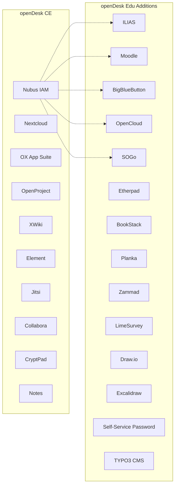
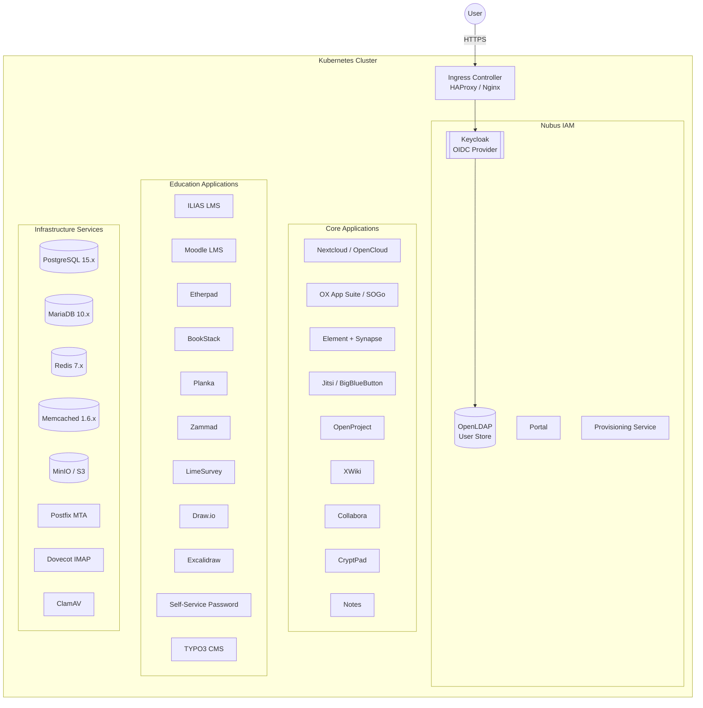
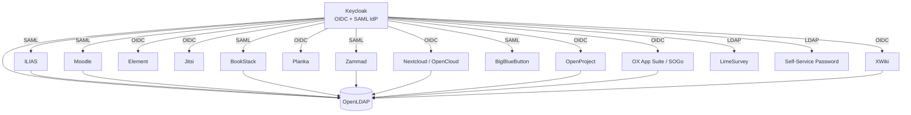
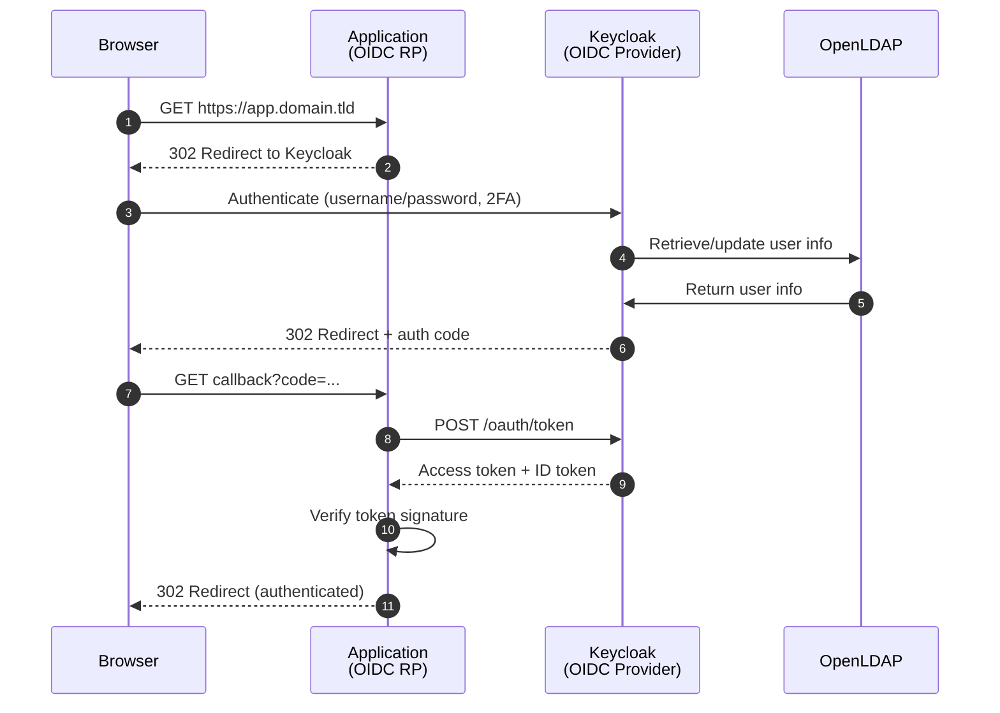
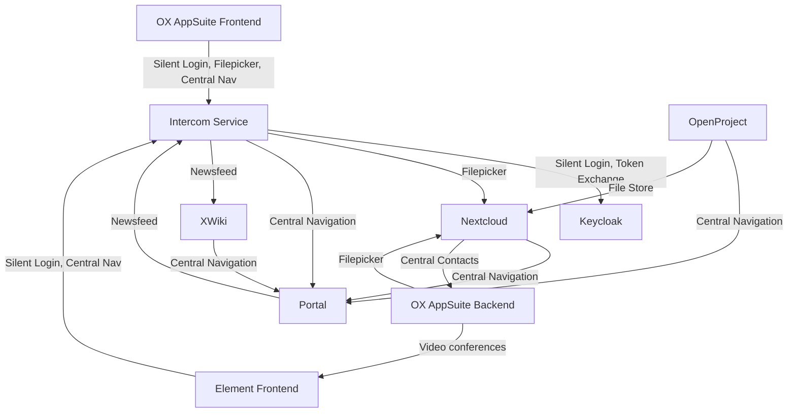

<!--
SPDX-FileCopyrightText: 2026 openDesk Edu Contributors
SPDX-License-Identifier: Apache-2.0
-->

# openDesk Edu — Open Specification

| Field | Value |
|:------|:------|
| **Version** | 1.0.0 |
| **Date** | 2026-06-26 |
| **Status** | Active |
| **License** | Apache-2.0 |
| **Upstream** | [openDesk CE v1.15.x](https://www.opencode.de/en/opendesk) |
| **Repository** | [GitHub](https://github.com/opendesk-edu/opendesk-edu) / [Codeberg](https://codeberg.org/opendesk-edu/opendesk-edu) |
| **Host** | HRZ Marburg, Philipps-Universitat Marburg |

---

## Table of Contents

1. [Executive Summary](#1-executive-summary)
2. [Project Overview](#2-project-overview)
3. [Architecture](#3-architecture)
4. [Component Catalog](#4-component-catalog)
5. [Identity and Access Management](#5-identity-and-access-management)
6. [Deployment Model](#6-deployment-model)
7. [External Services](#7-external-services)
8. [Storage Architecture](#8-storage-architecture)
9. [Network Architecture](#9-network-architecture)
10. [Security](#10-security)
11. [Monitoring and Observability](#11-monitoring-and-observability)
12. [Testing](#12-testing)
13. [Education-Specific Integrations](#13-education-specific-integrations)
14. [Scaling Guidelines](#14-scaling-guidelines)
15. [Roadmap](#15-roadmap)
16. [Requirements](#16-requirements)
17. [Contributing](#17-contributing)
18. [Repository Structure](#18-repository-structure)

---

## 1. Executive Summary

openDesk Edu is a Kubernetes-native digital workplace platform designed for universities and higher education institutions. It extends the openDesk Community Edition (CE) platform — developed under the ZenDiS project by the German Federal Ministry of the Interior — with education-specific services.

The platform provides a unified, single-sign-on experience across 25+ open-source applications covering file management, groupware, knowledge management, project management, video conferencing, and education-specific tools such as learning management systems (ILIAS, Moodle), collaborative editing (Etherpad), helpdesk (Zammad), survey platforms (LimeSurvey), and more.

**Key design principles:**

- **Sovereignty first** — every service is self-hosted; no data leaves the cluster
- **Helm-native** — all integrations deployed via Helm charts within the existing helmfile structure
- **SSO everywhere** — SAML 2.0 (Shibboleth SP) for legacy apps, OIDC for modern apps
- **LTI where it matters** — any teaching tool must be launchable from LMS via LTI 1.3
- **No NIH** — integrate proven open-source tools, don't rebuild them

---

## 2. Project Overview

### 2.1 Relationship to openDesk CE

openDesk Edu is a **superset** of openDesk CE, not a fork. All core openDesk CE components remain intact and functional. Education services are layered on top, integrated with the same Keycloak SSO and portal infrastructure.



### 2.2 Alternative Components

openDesk Edu introduces optional drop-in alternatives for three core CE components. Deployers choose **either** the standard component **or** its education-focused alternative:

| Standard (CE) | Alternative (Edu) | Rationale |
|:--------------|:-------------------|:----------|
| OX App Suite | SOGo | Email-focused, modern UI, better student experience, tight LDAP integration |
| Jitsi | BigBlueButton | Built for teaching: recording, whiteboard, breakout rooms, session timers |
| Nextcloud | OpenCloud | Lightweight for education: per-course shares, CS3-based sync |

### 2.3 Hosted Environment

The reference deployment runs at HRZ Marburg (Philipps-Universitat Marburg):

| Parameter | Value |
|:----------|:------|
| Platform | K3s v1.32.3 on Debian 12 |
| Nodes | 9 (3 control-plane + 6 workers) |
| Control plane | vhrz2331, vhrz2332, vhrz2333 |
| Workers | vhrz2334 through vhrz2339 |
| API endpoint | `https://192.168.3.200:6443` |
| Container runtime | containerd 2.0.4-k3s2 |
| Ingress | HAProxy + Nginx |
| GitOps | ArgoCD |
| Domain | `*.opendesk.hrz.uni-marburg.de` |
| Ingress IP | 192.168.3.201 |

---

## 3. Architecture

### 3.1 High-Level Architecture

openDesk Edu is designed as a Kubernetes deployment orchestrated by Helmfile over 35+ Helm charts.



### 3.2 Authentication Architecture

All services authenticate through Keycloak via either SAML 2.0 or OIDC. OpenLDAP serves as the authoritative user directory.



#### OIDC Sequence Diagram



### 3.3 Mail Architecture

```mermaid
flowchart TD
    subgraph External
        ExtRelay[Mailrelay / MX]
        ExtClient[Mail Clients<br/>Thunderbird]
    end

    subgraph Kubernetes
        Apps[Applications<br/>Nubus, Nextcloud, OpenProject,<br/>Synapse, XWiki, Notes]
        OXAS[OX App Suite]
        PF_Base[(Base) Postfix]
        PF_OX[Postfix-OX]
        DV[Dovecot<br/>SASL: LDAP + OAuth]
    end

    Apps -->|SMTP (static creds)| PF_Base
    DV -->|Sieve (no auth)| PF_Base
    OXAS -->|IMAP| DV
    OXAS -->|OAuth| PF_OX
    PF_Base -->|lmtps| DV
    PF_OX -->|lmtps| DV
    PF_Base -->|smtp| ExtRelay
    PF_OX -->|smtp| ExtRelay
    ExtClient -->|LDAP auth| PF_OX
```

**Key points:**
- (Base) Postfix handles SMTP submission from all applications using static credentials; available even without OX App Suite
- Postfix-OX is deployed exclusively when OX App Suite is present; requires Dovecot SASL for authentication
- Dovecot handles IMAP with SASL authentication via LDAP and OAuth
- All external mail delivery routes through the configured mail relay / MX

---

## 4. Component Catalog

### 4.1 Full Component Matrix

| # | Function | Component | License | Version | Auth | Database | Storage | Helm Chart |
|:--|:---------|:----------|:--------|:--------|:-----|:---------|:--------|:-----------|
| 1 | Chat & Calling | Element + Synapse | AGPL-3.0 / Apache-2.0 | 1.12.6 | OIDC | PostgreSQL | RWO | openDesk upstream |
| 2 | Notes | Notes (Docs) | MIT | 4.4.0 | OIDC | PostgreSQL | RWO | openDesk upstream |
| 3 | Diagrams | CryptPad | AGPL-3.0 | 2025.9.0 | via Nextcloud | — | RWO | openDesk upstream |
| 4 | Files | Nextcloud | AGPL-3.0 | 32.0.6 | OIDC | PostgreSQL | RWX + S3 | openDesk upstream |
| 5 | Alt Files | OpenCloud | Apache-2.0 | 4.0.3 | OIDC | PostgreSQL | RWX | local |
| 6 | Groupware | OX App Suite | GPL-2.0 / AGPL-3.0 | 8.46 | OIDC | MariaDB | RWO | openDesk upstream |
| 7 | Alt Groupware | SOGo | LGPL-2.1 | 5.11 | OIDC | PostgreSQL | RWO | local |
| 8 | Wiki | XWiki | LGPL-2.1 | 17.10.4 | OIDC | PostgreSQL | RWO | openDesk upstream |
| 9 | Portal & IAM | Nubus | AGPL-3.0 | 1.18.1 | — | PostgreSQL | RWO | openDesk upstream |
| 10 | Projects | OpenProject | GPL-3.0 | 17.2.1 | OIDC | PostgreSQL | RWO + S3 | openDesk upstream |
| 11 | Video Conf. | Jitsi | Apache-2.0 | 2.0.10590 | OIDC | — | — | openDesk upstream |
| 12 | Alt Video | BigBlueButton | LGPL-3.0 | 2.7 | SAML | PostgreSQL | RWX | local |
| 13 | Office | Collabora | MPL-2.0 | 25.04.8 | via Nextcloud | — | — | openDesk upstream |
| 14 | Mail Backend | Dovecot | LGPL-2.1 | — | SASL/OAuth | — | RWO | openDesk upstream |
| 15 | MTA | Postfix | IBM Public | — | — | — | — | openDesk upstream |
| 16 | LMS | ILIAS | GPL-3.0 | 7.28 | SAML | PostgreSQL | RWO + S3 | local |
| 17 | LMS | Moodle | GPL-3.0 | 4.4 | Shibboleth | PostgreSQL | RWX | local |
| 18 | Collab Editing | Etherpad | Apache-2.0 | 1.9.9 | OIDC | PostgreSQL | — | local |
| 19 | Knowledge Base | BookStack | MIT | 26.03 | SAML | MariaDB | RWO | local |
| 20 | Kanban | Planka | AGPL-3.0 | 2.1.0 | OIDC | PostgreSQL | RWO | local |
| 21 | Helpdesk | Zammad | AGPL-3.0 | 7.0 | SAML | PostgreSQL | RWO | local |
| 22 | Surveys | LimeSurvey | GPL-2.0 | 6.6 | LDAP | MariaDB | RWO | local |
| 23 | Diagrams | Draw.io | Apache-2.0 | 29.6 | stateless | — | — | local |
| 24 | Whiteboard | Excalidraw | MIT | latest | stateless | — | — | local |
| 25 | Password Reset | LTB SSP | GPL-3.0 | 1.7 | LDAP | — | — | local |
| 26 | CMS | TYPO3 | Apache-2.0 | 13.4 | OIDC | MariaDB | RWO | local |

### 4.2 Infrastructure Services (Evaluation Only)

| Service | Type | Version | Notes |
|:--------|:-----|:--------|:------|
| PostgreSQL | Database | 15.x | Shared by 15+ components |
| MariaDB | Database | 10.x | OX App Suite, BookStack, LimeSurvey, TYPO3 |
| Redis | Cache | 7.x | Nextcloud, Intercom Service, BBB, Zammad |
| Memcached | Cache | 1.6.x | OpenProject, UMS Self Service, SOGo |
| MinIO | Object Storage | — | OpenProject file store, ILIAS data |
| ClamAV | Antivirus | — | Distributed or Simple mode |
| Postfix | MTA | — | Base + OX variants |
| Dovecot | IMAP | — | SASL: LDAP + OAuth |

### 4.3 Local Helm Charts (Education-Specific)

22 custom Helm charts are maintained in `opendesk-edu/helmfile/charts/`:

| Chart | Purpose |
|:------|:--------|
| bigbluebutton | Teaching-optimized video conferencing |
| bookstack | Structured knowledge base |
| drawio | Diagram editor (stateless) |
| excalidraw | Whiteboard (stateless) |
| f13 | Sovereign AI assistant (7 microservices) |
| ilias | Full-featured LMS |
| limesurvey | Survey platform |
| moodle | Plugin-rich LMS |
| network-policies | Otterize intent-based network policies |
| opencloud | Alternative to Nextcloud |
| planka | Kanban boards |
| self-service-password | LDAP password reset |
| sogo | Alternative to OX App Suite |
| snipr | Lightweight lecture recording |
| typo3 | CMS |
| zammad | Helpdesk/ticketing |
| alertmanager | Prometheus alert routing |
| grafana-dashboards | Custom Grafana dashboards |
| loki | Log aggregation |
| promtail | Log shipping agent |
| grommunio | Groupware (experimental) |

---

## 5. Identity and Access Management

### 5.1 Nubus (IAM Platform)

[Nubus](https://www.univention.de/products/nubus/) provides the complete IAM stack:

1. **Identity Provider** — issues and manages authentication tokens
2. **Access Control** — RBAC policies enforced per application
3. **Integration Hub** — synchronizes identity data across all services
4. **User Provisioning** — automated account lifecycle (create, update, deactivate)
5. **IAM Administration** — UMC (Univention Management Console) for admin operations
6. **Frontend Integration** — Intercom Service (Backend-for-Frontend pattern)
7. **Portal** — unified entry point with self-service capabilities

### 5.2 Authentication Methods by Service

| Protocol | Services | Integration Pattern |
|:---------|:---------|:--------------------|
| **SAML 2.0** (Shibboleth SP) | ILIAS, Moodle, BigBlueButton, BookStack, Zammad | SP-initiated SSO; Keycloak as IdP |
| **OIDC** | Nextcloud, OpenCloud, OX App Suite, SOGo, OpenProject, XWiki, Element, Jitsi, Planka, Notes, TYPO3 | OAuth2 authorization code flow |
| **LDAP bind** | LimeSurvey, Self-Service Password, OpenLDAP consumers | Direct LDAP search with service accounts |
| **Token exchange** | Collabora (via Nextcloud), CryptPad (via Nextcloud) | Relies on parent service session |
| **Stateless** | Draw.io, Excalidraw | No authentication required |

### 5.3 LDAP Group Synchronization

Groups are synchronized from OpenLDAP to applications via Keycloak LDAP federation. Key behaviors:

- **No nested group support** — users must be direct members; subgroup members are ignored
- **Nextcloud**: reads enabled groups twice daily (`background_sync_interval`)
- **XWiki**: reads enabled groups once daily (nightly `LDAP Group Import Job`)
- **OpenProject**: reads enabled groups hourly
- **OX App Suite**: requires webmail user in group before active provisioning

### 5.4 Component Integration

The Intercom Service enables cross-application communication:



### 5.5 DFN-AAI / eduGAIN Federation

German universities authenticate via the DFN-AAI federation. openDesk Edu operates as a SAML Service Provider:

- Supports standard eduGAIN attributes: `eduPersonAffiliation`, `mail`, `displayName`, `persistentId`
- Shibboleth IdP supported as external identity provider
- Federation metadata generation documented for deployers
- Attribute mapping via Keycloak: eduPerson claims to internal groups

### 5.6 Application-Specific User Accounts

| Application | Account | Purpose |
|:------------|:--------|:--------|
| Collabora | `collabora-internal-admin` | Admin dashboard access |
| Element | `uvs` | User Verification Service |
| Element | `meeting-bot` | Nordeck Meeting-Bot room management |
| Nextcloud | `nextcloud` | Bootstrap fileshare for OpenProject |
| OX App Suite | `admin` | OX Connector provisioning |
| OpenProject | (configurable) | Bootstrap fileshare for OpenProject |
| XWiki | `superadmin` | Debug mode interactive login |

---

## 6. Deployment Model

### 6.1 Helmfile Orchestration

The deployment is orchestrated by [Helmfile](https://helmfile.readthedocs.io/) over 35+ Helm charts.

**Root entry point:** `helmfile.yaml.gotmpl`

```yaml
environments:
  dev:
    values:
      - "helmfile/environments/dev/*.yaml.gotmpl"
  test:
    values:
      - "helmfile/environments/test/*.yaml.gotmpl"
  prod:
    values:
      - "helmfile/environments/prod/*.yaml.gotmpl"
```

**Generic helmfile:** `helmfile_generic.yaml.gotmpl` — includes all child helmfiles in deployment order:

1. `opendesk-migrations-pre` — pre-migration hooks
2. `opendesk-services` — shared infrastructure (PostgreSQL, MariaDB, Redis, etc.)
3. `services-external` — external service references
4. `nubus` — IAM stack
5. `open-xchange` — groupware (if enabled)
6. `nextcloud` — file share (if enabled)
7. `opencloud` — alternative file share (if enabled)
8. `collabora` — office editing
9. `cryptpad` — diagram editor
10. `jitsi` / `element` — chat and video
11. `openproject` — project management
12. `xwiki` — wiki
13. `notes` — collaborative notes
14. **Education services:** etherpad, bookstack, planka, zammad, limesurvey, drawio, excalidraw, self-service-password, sogo, typo3
15. `opendesk-openproject-bootstrap` — OpenProject-Nextcloud integration
16. `opendesk-migrations-post` — post-migration hooks

### 6.2 One-Command Deploy

```bash
helmfile -e default apply
```

### 6.3 Environment Configuration

Each environment has its own values directory:

```
helmfile/environments/
  default/
    global.yaml.gotmpl       # Domain, features, storage classes
    *.yaml.gotmpl             # Additional config files
  dev/
  test/
  prod/
```

### 6.4 Migration Hooks

Pre- and post-deployment migration jobs ensure data integrity during upgrades:

- `opendesk-migrations-pre` — runs before any application is updated
- `opendesk-migrations-post` — runs after all applications are updated
- Example: XWiki user merge migration (Java), PVC data migration scripts

### 6.5 GitOps with ArgoCD

Production deployment uses ArgoCD for GitOps. The `argocd-opendesk/` directory contains ArgoCD Application manifests that sync from the git repository to the cluster.

---

## 7. External Services

### 7.1 Required Production Services

For production deployments, the bundled services must be replaced with production-grade equivalents.

#### Database Services

| Component | Database | Type | Default Host | Default Port | Parameter |
|:----------|:---------|:-----|:-------------|:-------------|:----------|
| Element/Synapse | PostgreSQL | postgresql | `postgresql` | 5432 | `databases.synapse.*` |
| Keycloak | PostgreSQL | postgresql | `postgresql` | 5432 | `databases.keycloak.*` |
| Keycloak Extensions | PostgreSQL | postgresql | `postgresql` | 5432 | `databases.keycloakExtension.*` |
| Nextcloud | PostgreSQL | postgresql | `postgresql` | 5432 | `databases.nextcloud.*` |
| Notes | PostgreSQL | postgresql | `postgresql` | 5432 | `databases.notes.*` |
| OpenProject | PostgreSQL | postgresql | `postgresql` | 5432 | `databases.openproject.*` |
| XWiki | PostgreSQL | postgresql | `postgresql` | 5432 | `databases.xwiki.*` |
| OX App Suite | MariaDB | mariadb | `mariadb` | 3306 | `databases.oxAppSuite.*` |
| **ILIAS** | PostgreSQL | postgresql | `postgresql` | 5432 | `databases.ilias.*` |
| **Moodle** | PostgreSQL | postgresql | `postgresql` | 5432 | `databases.moodle.*` |
| **BigBlueButton** | PostgreSQL | postgresql | `postgresql` | 5432 | `databases.bbb.*` |
| **Etherpad** | PostgreSQL | postgresql | `postgresql` | 5432 | `databases.etherpad.*` |
| **BookStack** | MariaDB | mariadb | `mariadb` | 3306 | `databases.bookstack.*` |
| **Planka** | PostgreSQL | postgresql | `postgresql` | 5432 | `databases.planka.*` |
| **Zammad** | PostgreSQL | postgresql | `postgresql` | 5432 | `databases.zammad.*` |
| **LimeSurvey** | MariaDB | mariadb | `mariadb` | 3306 | `databases.limesurvey.*` |
| **SOGo** | PostgreSQL | postgresql | `postgresql` | 5432 | `databases.sogo.*` |
| **TYPO3** | MariaDB | mariadb | `mariadb` | 3306 | `databases.typo3.*` |

#### Cache Services

| Component | Cache Type | Default Host | Default Port | Parameter |
|:----------|:----------|:-------------|:-------------|:----------|
| Intercom Service | Redis | `redis-headless` | 6379 | `cache.intercomService.*` |
| Nextcloud | Redis | `redis-headless` | 6379 | `cache.nextcloud.*` |
| OpenProject | Memcached | `memcached` | 11211 | `cache.openproject.*` |
| UMS Self Service | Memcached | `memcached` | 11211 | `cache.umsSelfservice.*` |
| **BigBlueButton** | Redis | `redis-headless` | 6379 | `cache.bbb.*` |
| **Zammad** | Redis | `redis-headless` | 6379 | `cache.zammad.*` |
| **SOGo** | Memcached | `memcached` | 11211 | `cache.sogo.*` |

#### Object Storage

| Component | Default Backend | Parameter | Default Bucket |
|:----------|:----------------|:----------|:---------------|
| OpenProject | MinIO | `objectstores.openproject.*` | `openproject` |
| **ILIAS** | S3 | `objectstores.ilias.*` | `ilias-data` |

### 7.2 Other External Dependencies

| Service | Purpose | Configuration |
|:--------|:---------|:-------------|
| cert-manager | TLS certificate management | Optional but recommended |
| ClamAV | Antivirus / ICAP scanning | Distributed or Simple mode |
| Postfix | Mail relay / MX | `databases.*` for SMTP credentials |
| Coturn | TURN server for WebRTC | Voice/video NAT traversal |
| Proxy | `http://www-proxy2.uni-marburg.de:3128` | For pods requiring internet access |

---

## 8. Storage Architecture

### 8.1 Storage Classes

| Storage Class | Type | Use Case |
|:-------------|:-----|:---------|
| `ceph-rbd-ssd` | RWO, fast (Ceph RBD on SSD) | Databases, stateful sets |
| `ceph-cephfs-hdd-ec` | RWX, erasure-coded (CephFS on HDD) | Shared files, distributed storage |

### 8.2 PVC Strategy

- **RWO PVCs** (databases, stateful application data): use `ceph-rbd-ssd`
- **RWX PVCs** (shared file storage, Nextcloud data, BBB recordings): use `ceph-cephfs-hdd-ec`
- **29 RWO PVCs** are excluded from k8up backup via `k8up.io/exclude: "true"` annotation
- **RWX PVCs** backed up by k8up Schedule `backup-live` (daily at 00:42)

### 8.3 Backup with k8up

[k8up](https://k8up.io/) provides restic-based backups:

- **Schedule**: `backup-live` runs daily at 00:42
- **Target**: `s3:https://s3.hrz.uni-marburg.de/backups`
- **Scope**: Only RWX PVCs (due to RWO multi-node mount limitation)
- **RWX PVCs backed up**: `clamav-db`, `clamav-tmp`, `dovecot`, `opendesk-opencloud-data`, `seaweedfs-all-in-one-data`, `slidev-slides`
- **RWO PVCs**: require separate backup strategy (CSI snapshots or per-node schedules)

---

## 9. Network Architecture

### 9.1 Ingress

Two ingress controllers are supported:

| Controller | Status | Notes |
|:-----------|:-------|:------|
| HAProxy Ingress | Recommended (since 1.13) | Primary choice |
| Nginx Ingress | Deprecated | Still supported with caveats |

**HAProxy tuning** (recommended for large header components):
```yaml
controller:
  config:
    config-global: |
      tune.bufsize 65536
      tune.http.maxhdr 256
```

**Required**: `allowSnippetAnnotations=true` on the ingress controller for openDesk components that use snippet annotations.

### 9.2 DNS

- Domain: `*.opendesk.hrz.uni-marburg.de` resolves to ingress IP `192.168.3.201`
- Nameservers: `137.248.21.22`, `137.248.1.5`, `137.248.1.8`
- **Known quirk**: CoreDNS returns SERVFAIL on external CNAME chains (HRZ-specific). Workaround: use `hostAliases` in deployments for internal domains.

### 9.3 Outbound Proxy

Pods requiring internet access must route through `http://www-proxy2.uni-marburg.de:3128`.

**DNS note**: `www-proxy2.uni-marburg.de` resolves in DNS; `proxy02.hrz.uni-marburg.de` does NOT.

### 9.4 TLS

- TLS certificates managed by [cert-manager](https://cert-manager.io/)
- Certificate resources deployed; cert-manager CRDs must be pre-installed
- Alternative: provide a secret with a valid TLS certificate

---

## 10. Security

### 10.1 Helm Chart Trust Chain

- Charts signed with GPG keys stored in `helmfile/files/gpg-pubkeys`
- Verified by Helmfile on deployment
- OX charts verified via Cosign (external verification supported)
- Collabora controller charts not verifiable via GPG

### 10.2 Network Policies

- Default Otterize `ClientIntents` shipped with the deployment
- Translates intent-based access control (IBAC) to Kubernetes NetworkPolicies
- Requires Otterize intents operator to be installed
- Enabled via: `security.otterizeIntents.enabled: true`

### 10.3 Keycloak Security Extensions

- **Brute-force protection**: blocks authentication requests after too many failed attempts from a device/IP (CAPTCHA option deactivated)
- **New device notification**: sends email after successful login from new device
- Extensions act as a proxy to Keycloak

### 10.4 Known Security Considerations

- SAML backchannel logout not yet implemented for ILIAS, Moodle, BBB (planned v1.1)
- OIDC backchannel logout not yet implemented for OpenCloud, Nextcloud (planned v1.1)
- Never disable brute-force protection in production

---

## 11. Monitoring and Observability

### 11.1 Prometheus Stack

- Full Prometheus + Grafana deployment via kube-prometheus-stack
- Custom dashboards in `monitoring/` directory
- Prometheus exporters for service-level metrics

### 11.2 Logging

- **Loki** — log aggregation
- **Promtail** — log shipping agent (daemonset on each node)
- **Elasticsearch** — alternative log backend (3-node cluster in `logging` namespace)
- **Kibana** — log visualization (currently CrashLoopBackOff — known issue)
- **Filebeat** — log forwarder
- **Metricbeat** — metrics collector

### 11.3 Alerting

- **Alertmanager** — Prometheus alert routing
- Custom alerting rules for service health
- Grafana dashboards for openDesk-specific metrics

### 11.4 Custom Dashboards

Education-specific Grafana dashboards maintained in `opendesk-edu/helmfile/charts/grafana-dashboards/`.

---

## 12. Testing

### 12.1 Playwright E2E Tests

Integration tests using Playwright verify end-to-end service functionality:

| Test | Purpose |
|:-----|:-------|
| `portal-login.spec.js` | Portal SSO login flow |
| `backchannel-e2e.spec.js` | Backchannel logout verification |
| `nc_backchannel.spec.js` | Nextcloud backchannel integration |

### 12.2 Helm Chart Testing

- `ct.yaml` configuration for Helm chart tests
- `helmfile/charts/` tested via `helm test` and chart-testing tools

### 12.3 CI/CD

- GitHub Actions workflows (`.github/`)
- Playwright tests triggered on push/PR
- Codeberg mirror updated manually (see `docs/maintenance/github-codeberg-sync.md`)

---

## 13. Education-Specific Integrations

### 13.1 LTI 1.3 Integration

Teaching tools can be launched from LMS courses via LTI 1.3:

| Tool | LTI Support | Notes |
|:-----|:------------|:------|
| BigBlueButton | Full | Native LTI integration for course meetings |
| Opencast (planned) | Full | Lecture recording launch from courses |
| SNIpR | Basic | Lightweight recording alternative |
| ILIAS | Provider | Can act as both LTI consumer and provider |
| Moodle | Provider | Full LTI 1.3 support |

### 13.2 Semester Lifecycle Management

Universities operate on semester cycles (Wintersemester / Sommersemester):

- **Course provisioning API**: create/archive courses per semester
- **Role-based access**: instructor, student, tutor tied to semester enrollment
- **Automated archival**: course content frozen at semester end
- **Campus management hooks**: integration with HIS/LSF systems
- **Semester automation scripts** in `scripts/`

### 13.3 User Provisioning

- **Two-phase deprovisioning**: disable (6-month grace period) then permanent delete
- **SAML account linking**: via Keycloak admin API (`federated-identity` endpoints)
- **UCS/UDM REST API**: for provisioning LDAP groups, CSV/ODS import
- **User import tooling** in `scripts/user_import/`

### 13.4 Shibboleth IdP Integration

For universities with existing Shibboleth IdP:

- External IdP support in Keycloak via identity provider federation
- Attribute mapping: `eduPersonAffiliation`, `mail`, `displayName`, `persistentId`
- Documentation: `docs/shibboleth-idp-integration.md`, `docs/edugain-attribute-mapping.md`

### 13.5 DFN-AAI Federation

- openDesk Edu registered as SAML SP in DFN-AAI
- Standard eduGAIN attribute support
- Federation metadata generation for deployers
- Testing guide: `docs/dfn-aai-testing-guide.md`
- Enrollment: `docs/federation/dfn-aai-enrollment.md`

---

## 14. Scaling Guidelines

### 14.1 Core Component Scaling

| Application | Resources per N users | Notes |
|:------------|:----------------------|:------|
| Collabora | 1 vCPU + 50 MB RAM per 15 active users | +1 MBit/s per 10 active users |
| Element | 15 vCPU + 12 GB RAM per 10k users (federation on) | Synapse + PostgreSQL |
| Jitsi | 4 vCPU + 8 GB RAM (meet server) | +8 vCPU + 8 GB RAM per 200 concurrent users (JVB) |
| Nextcloud | 4-20 pods x 8 vCPU + 32-64 GB RAM | Scales horizontally |
| OpenProject | 4-6 vCPU + 6-8 GB RAM per 500 users | Scale web workers first |
| OX App Suite | 10 vCPU + 58 GB RAM per 200 users | Includes Dovecot |
| XWiki | 4 vCPU + 6 GB RAM | Small instance baseline |

### 14.2 Education Component Scaling

| Application | Recommended Minimum | Notes |
|:------------|:--------------------|:------|
| ILIAS | 4 vCPU + 8 GB RAM | PostgreSQL separate, S3 for course files |
| Moodle | 4 vCPU + 8 GB RAM | Redis cache recommended |
| BigBlueButton | 8 vCPU + 16 GB RAM | Redis required; scale with meeting rooms |
| SOGo | 2 vCPU + 4 GB RAM | Lightweight; memcached for cache |
| Zammad | 4 vCPU + 8 GB RAM | Redis + Elasticsearch for search |
| Planka | 1 vCPU + 2 GB RAM | Lightweight; PostgreSQL separate |
| Etherpad | 1 vCPU + 1 GB RAM | Stateless workers can scale horizontally |
| BookStack | 1 vCPU + 2 GB RAM | MariaDB separate |

---

## 15. Roadmap

### 15.1 Current State (v1.0) — All Complete

| Feature | Status |
|:--------|:------:|
| ILIAS LMS with SAML SSO | Done |
| Moodle LMS with Shibboleth | Done |
| BigBlueButton / Jitsi (alternative) | Done |
| OpenCloud / Nextcloud (alternative) | Done |
| Unified Keycloak SSO | Done |
| Portal integration | Done |
| Etherpad, BookStack, Planka, Zammad, LimeSurvey | Done |
| Draw.io, Excalidraw, Self-Service Password | Done |
| SOGo groupware alternative | Done |

### 15.2 v1.1 — Foundation

- [ ] DFN-AAI test federation validation
- [ ] SAML backchannel logout (ILIAS, Moodle, BBB)
- [ ] OIDC backchannel logout (OpenCloud, Nextcloud)
- [ ] Docker image for standalone user_import execution

### 15.3 v1.2 — Lecture Recording

- [ ] Opencast + Tobira Helm charts (enterprise lecture recording)
- [ ] SNIpR Helm chart (lightweight alternative)
- [ ] LTI 1.3 integration with ILIAS and Moodle
- [ ] GPU scheduling for Whisper transcription

### 15.4 v1.5 — Campus Management (HISinOne / Marvin)

Five-phase integration with the dominant German campus management system:

- **Phase 1**: Identity & Account Lifecycle (Keycloak LDAP federation)
- **Phase 2**: Course Synchronization (HISinOne-Proxy)
- **Phase 3**: Schedule, Rooms & Exams
- **Phase 4**: Study Progress & Advising
- **Phase 5**: Cross-Service Intelligence

### 15.5 v2.0 — Course Evaluation & E-Portfolio

- [ ] EvaP course evaluation (Helm chart, Keycloak SSO)
- [ ] Mahara e-portfolio (Helm chart, SAML, LTI)

### 15.6 v2.1 — Campus Operations

- [ ] MRBS room booking
- [ ] LEIHS equipment booking

### 15.7 v3.0 — Digital Examination

- [ ] R/exams + Safe Exam Browser
- [ ] JPlag plagiarism detection (KIT, 15+ languages, fully local)

### 15.8 v4.0 — AI & Analytics

- [ ] Local LLM inference (vLLM / Ollama)
- [ ] Learning analytics (xAPI)
- [ ] F13 sovereign AI assistant (7 microservices, Keycloak-native, GPU optional)

### 15.9 v5.0 — Federation & Multi-Tenancy

- [ ] Cross-university service sharing
- [ ] SATOSA proxy (SAML-to-OIDC translation)
- [ ] Multi-tenant Keycloak
- [ ] Research data management (EOSC)

### 15.10 Timeline

```
2026 Q2  v1.0  Core platform + 13 education services
2026 Q3  v1.1  DFN-AAI federation + semester lifecycle + logout
2026 Q4  v1.2  Opencast + Tobira lecture recording
2027 Q1  v1.5  HISinOne campus management (Phase 1: identity)
2027 Q2  v1.5  HISinOne (Phase 2-3: courses, schedule/exams)
2027 Q3  v2.0  EvaP + Mahara (evaluation + portfolio)
2027 Q4  v2.1  MRBS + LEIHS (room + equipment booking)
2028 Q1  v3.0  R/exams + JPlag (digital examination)
2028 Q2  v4.0  Local LLM + F13 sovereign AI
2028 Q3  v5.0  Multi-tenancy + SATOSA + research data
```

---

## 16. Requirements

### 16.1 Platform Requirements

| Requirement | Version | Notes |
|:------------|:--------|:------|
| Kubernetes | >= 1.24 | CNCF Certified distribution; tested with kubespray |
| Helm | >= 3.17.3 | NOT 3.18.0 (bug) or 4.x (incompatible) |
| Helmfile | >= 1.0.0 | |
| HelmDiff | >= 3.11.0 | Required by Helmfile |
| cert-manager | installed | For TLS; optional if providing manual certs |
| Ingress controller | HAProxy or Nginx >= 4.11.5 | With snippet annotations enabled |

### 16.2 Hardware Minimums (Evaluation)

| Spec | Value |
|:-----|:------|
| CPU | 12 cores (x64/x86) |
| RAM | 32 GB (more recommended) |
| Disk | 10 GB+ (HDD or SSD) |

### 16.3 Storage Requirements

| Type | Use Case |
|:-----|:---------|
| RWO provisioner | Databases, stateful application data |
| RWX provisioner | Distributed mode, horizontal scaling (sticky bit support required) |

> **Warning**: `local-path-provisioner` does NOT support sticky bits; OpenProject seeder job will fail without a proper provisioner.

### 16.4 Enterprise Requirements

- [OpenKruise](https://openkruise.io/) >= v1.6 — required for Dovecot Pro

---

## 17. Contributing

### 17.1 Branch Model

- `main` branch — stable, production-ready
- Feature branches — development
- `deploy/hrz` — HRZ-specific deployment configuration
- `gh-pages` — documentation site

### 17.2 PR Discipline

- **Separate code changes from chart changes** — never mix in one PR
- Code PRs: label `area:operator`, never touch `charts/`
- Chart PRs: label `area:chart` + `chart:<name>`, bump Chart version
- Run `make chart-docs` for chart documentation

### 17.3 REUSE Compliance

- SPDX headers required on all files
- `REUSE.toml` for REUSE compliance
- License: Apache-2.0 unless otherwise noted

### 17.4 Code Style

- **Go**: tabs, LF, no trailing whitespace, grouped imports (stdlib, external, internal)
- **Python**: 4-space indentation, snake_case, specific exceptions only
- **YAML/Helm**: 2-space indentation, `{{- -}}` for whitespace control
- **TypeScript**: ESLint + Prettier

### 17.5 Documentation Standards

- `README.md` + `AGENTS.md` in each major sub-project
- `CHANGELOG.md` for release-tracked sub-projects
- Presentations available in 30 languages (LinuxTag 2026)

---

## 18. Repository Structure

```
opendesk-edu/
  helmfile/
    apps/                    # Per-app helmfile child configs (25 apps)
      bigbluebutton/
      bookstack/
      cryptpad/
      drawio/
      etherpad/
      excalidraw/
      ilias/
      jitsi/
      limesurvey/
      moodle/
      opencloud/
      openproject/
      opendesk-migrations-post/
      opendesk-migrations-pre/
      opendesk-openproject-bootstrap/
      opendesk-services/
      planka/
      self-service-password/
      services-external/
      sogo/
      typo3/
      xwiki/
      zammad/
      ...
    charts/                  # Local Helm charts (22 education-specific)
      alertmanager/
      bigbluebutton/
      bookstack/
      drawio/
      excalidraw/
      f13/
      grafana-dashboards/
      ilias/
      limesurvey/
      loki/
      moodle/
      network-policies/
      opencloud/
      planka/
      promtail/
      self-service-password/
      sogo/
      snipr/
      typo3/
      zammad/
    environments/
      default/
      dev/
      prod/
      test/
    shared/
    bases/
  docs/
    architecture/
    assets/
    developer/
    external-services/
    federation/
    lecture-recording/
    presentations/
  scripts/
    user_import/
    saml-generators/
    semester-tools/
  tests/
    playwright/
  collab-dashboard/
  dev/
  .forgejo/
  .github/
  .kyverno/
  .sisyphus/
  helmfile.yaml.gotmpl         # Root helmfile
  helmfile_generic.yaml.gotmpl # Generic helmfile (all releases)
  publiccode.yml
  REUSE.toml
  CHANGELOG.md
  ROADMAP.md
  CONTRIBUTING.md
  LICENSE
  README.md
```

---

## Appendix A: Active Namespaces (HRZ Cluster)

| Namespace | Purpose |
|:----------|:--------|
| argocd | GitOps controller |
| buildkit | Container builds |
| ceph-csi-cephfs | CephFS CSI driver |
| ceph-csi-rbd | RBD CSI driver |
| cert-manager | TLS certificates |
| default | Miscellaneous workloads |
| demo-opendesk-edu | Demo deployment |
| dovecot-eval | Dovecot evaluation |
| dovecot-wormhole | Dovecot wormhole |
| deepl | DeepL translation service |
| elastic-system | Elasticsearch operator |
| gitlab-runner-puppet | CI/CD runners |
| ingress-controller | HAProxy ingress |
| kube-node-lease | Kubernetes node leases |
| kube-public | Kubernetes public data |
| kube-system | Kubernetes system components |
| kuvasz-uptime | Uptime monitoring |
| logging | ELK stack (Elasticsearch, Kibana, Filebeat, Metricbeat) |
| **opendesk** | Main openDesk Edu deployment |
| testing | Test workloads |
| traefik | Traefik ingress |

## Appendix B: Known Issues (HRZ-Specific)

| # | Issue | Impact | Mitigation |
|:--|:-----|:-------|:-----------|
| 1 | CoreDNS SERVFAIL on external CNAME chains | External DNS resolution fails | Use `hostAliases` for internal domains |
| 2 | `proxy02.hrz.uni-marburg.de` unresolvable | Proxy hostname fails | Use `www-proxy2.uni-marburg.de` instead |
| 3 | MariaDB password staleness | Helm-deployed password may differ | Check and sync `ALTER USER` |
| 4 | Nextcloud AIO probe bug | 10x PHP-FPM load, container restarts | Patch deployment and chart template |
| 5 | MariaDB transient "Connection refused" | ILIAS cronjobs fail on first attempt | 5-attempt retry loop with 10s sleep |
| 6 | Planka Helm chart annotation conflict | HAProxy ingress misrouted | Remove `kubernetes.io/ingress.class: nginx` annotation |
| 7 | k8up RWO PVC backup stuck | Backup pod hangs in ContainerCreating | Annotate RWO PVCs with `k8up.io/exclude: "true"` (done: 29 PVCs) |
| 8 | Nextcloud requires OCI registry credentials | `helmfile sync` fails without creds | Set `OD_PRIVATE_REGISTRY_USERNAME` and `OD_PRIVATE_REGISTRY_PASSWORD` |
| 9 | Grafana ingress class mismatch | Dashboard not accessible | Switch from `nginx` to `haproxy` ingress class |
| 10 | license-cache CronJob broken | StartError: binary missing in image | Suspend CronJob; wait for chart update |
