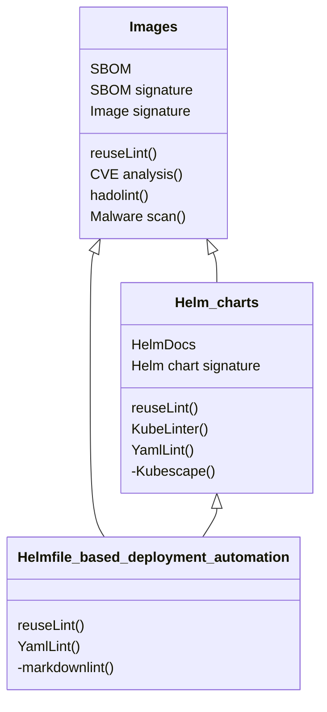
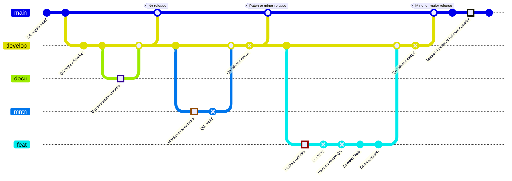
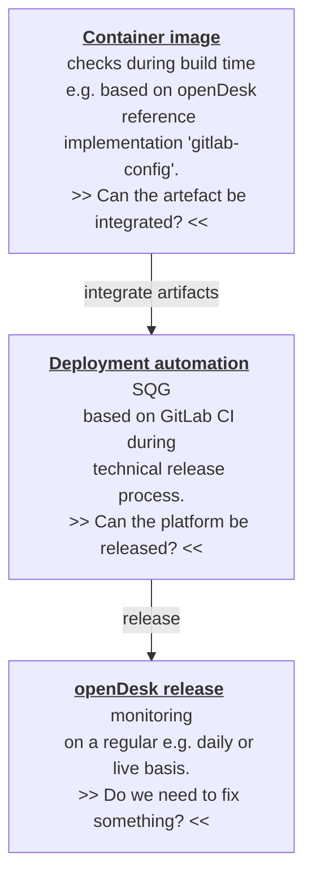

<!--
SPDX-FileCopyrightText: 2023 Bundesministerium des Innern und für Heimat, PG ZenDiS "Projektgruppe für Aufbau ZenDiS"
SPDX-FileCopyrightText: 2024 Zentrum für Digitale Souveränität der Öffentlichen Verwaltung (ZenDiS) GmbH
SPDX-License-Identifier: Apache-2.0
-->

<h1>Technical development and release workflow</h1>

* [Scope](#scope)
* [Roles and responsibilities](#roles-and-responsibilities)
* [Deployment automation](#deployment-automation)
  * [openDesk technical component classes](#opendesk-technical-component-classes)
  * [Functional vs. service components](#functional-vs-service-components)
  * [Origins](#origins)
  * [Reference CI for creating Images and Helm charts (gitlab-config)](#reference-ci-for-creating-images-and-helm-charts-gitlab-config)
  * [Licensing](#licensing)
  * [Development workflow](#development-workflow)
    * [Disclaimer](#disclaimer)
    * [Workflow](#workflow)
      * [Branching concept](#branching-concept)
      * [Standard Quality Gate (SQG)](#standard-quality-gate-sqg)
      * [Branch workflows](#branch-workflows)
        * [`main`](#main)
        * [`develop`](#develop)
        * [`docu`](#docu)
        * [`mntn`](#mntn)
        * [`feat`](#feat)
      * [Branch names](#branch-names)
      * [Commit messages / Conventional Commits](#commit-messages--conventional-commits)
      * [Verified commits](#verified-commits)
* [Footnotes](#footnotes)

# Scope

This document covers the development of a technical release, thereby addressing
- the development and branching concept for the openDesk deployment automation,
- the related quality gates and
- how technical releases are being created.

It does not cover additional artifacts that might be related to a functional release.

# Roles and responsibilities

The following section should provide a high-level view of the involved parties in the openDesk context and their responsibilities:

- **Open source product suppliers**
  - Focus areas
    - Development of upstream products
    - Development of integrative functionality relevant to openDesk and others
    - Providing source code and the artifacts required to install openDesk to Open CoDE
  - Hand over to _openDesk platform development_
    - Helm charts
    - Container images
    - Documentation
- **openDesk platform development**
  - Focus areas
    - Integration of the supplier's artifacts addressing basic operational needs
    - Implementation of services required (e.g. persistence layer) to develop and test openDesk
    - Implementation of the required quality gates (QG)
    - Ensuring the quality gates are passed
  - Hand over to _Operator_
    - Deployment automation
- **Operator**
  - Focus areas
    - Providing production-grade required services (e.g. persistence layer) to operate openDesk
    - Rollout, operate, and support openDesk
    - Further develop the deployment automation to meet extended operational requirements, ideally providing these developments upstream to openDesk platform development to adopt them into the standard
  - The operator can either use a self-operated Kubernetes cluster to deploy openDesk or make use of managed Kubernetes offerings of a **Cloud Provider**.

# Deployment automation

The openDesk deployment automation is the core outcome of the platform development process.

The openDesk platform development team created and maintains the deployment automation to allow interested parties to deploy openDesk into their cloud infrastructure with a low entry barrier. The core technology for the automation are [Helm charts](https://helm.sh/) which are orchestrated using [Helmfile](https://github.com/helmfile/helmfile). Of course this deployment is also used in the everyday work by the suppliers and the platform team.

Please find the deployment automation including the relevant documentation here: https://gitlab.opencode.de/bmi/opendesk/deployment/sovereign-workplace

The automation supports Gitlab CI/CD execution as well as local execution triggering the Helmfile deployment for the whole platform or single applications.

## openDesk technical component classes

The below rendering in class diagram notation shows the three component classes openDesk consists of. In each of these:
- the first section below the name of the class shows the required **characteristics** of each component of the given class, and
- the second section shows the **methods** like linting that have to be applied to artifacts of that class.

**Note:** The methods prefixed with '-' are not yet available in `gitlab-config` you will learn about them later.



## Functional vs. service components

The focus of openDesk is to provide an integrated functional productivity platform based on the functional components (products) of the involved suppliers. These functional components usually rely on certain service components, e.g. database services for persistence. When running openDesk in production the operator is responsible for providing these services production grade. For evaluation and development purposes the openDesk deployment automation includes these services.

Find the list of functional and service components in the [deployment automation's components.md](https://gitlab.opencode.de/bmi/opendesk/deployment/sovereign-workplace/-/blob/main/docs/components.md).

## Origins

The openDesk platform consolidates the technical components from various origins:

1) Supplier - for functional components: Provide their upstream product including sometimes openDesk-specific builds or extensions and also the deployment of the product (Helm charts).
2) 3rd party upstream - for service components: The platform development tries to use as many as possible community upstream components for the services they have to provide within openDesk.
3) Platform development - filling the gap: Some suppliers might not provide Helm charts or images for their product that fit the needs of openDesk and some 3rd party upstream components are not built to fit into openDesk. In these cases, the platform development team creates their own Helm charts and images.

## Reference CI for creating Images and Helm charts (gitlab-config)

As mentioned in the chapter "Origins" above, the openDesk platform development also creates images and Helm charts when needed.

For that purpose openDesk provides a [GitLab CI-based reference implementation](https://gitlab.opencode.de/bmi/souveraener_arbeitsplatz/tooling/gitlab-config) called `gitlab-config` to achieve the required characteristics and apply the necessary methods including releasing the artifacts based on [Semantic Release](https://github.com/semantic-release/semantic-release#readme) into the GitLab container registry.

## Licensing

As a standard, the openDesk platform development team uses [reuse.software](https://reuse.software/) wherever possible to annotate license and copyright.

openDesk uses Apache 2.0 as the license for their work. A typical reuse copyright and license header looks like this:
```
# SPDX-FileCopyrightText: 2024 Zentrum für Digitale Souveränität der Öffentlichen Verwaltung (ZenDiS) GmbH
# SPDX-License-Identifier: Apache-2.0
```
As the way to mark the license header as a comment differs between the various filetypes, please find matching examples for the types all across the [deployment automation repository](https://gitlab.opencode.de/bmi/souveraener_arbeitsplatz/deployment/sovereign-workplace).

**Remark**: If there is already an existing `SPDX-FileCopyrightText` please just add the one from the above example.

## Development workflow

### Disclaimer

openDesk consists only of community products, so there is no SLA to receive service updates or backport of critical security fixes. This has two consequences:
- In production scenarios, you should replace the community versions of the functional components with supported, SLA-backed paid versions.
- openDesk aims to always update to the latest available releases of the community components and we therefore have rolling technical releases.

### Workflow

This chapter describes the development workflow of the deployment automation. The suppliers have their development processes and workflows. While we aim to update always to the most recent community version(s) available, openDesk also sponsors development done by the suppliers. As the openDesk team has to take a closer look at these sponsored features, they are referred to as *supplier deliverables* within the platform development workflow.

#### Branching concept

The picture below uses Gitflow notation to give an overview of the different types of development flows.

The basic facts for the flow are:
- When the `develop` branch is merged into `main` a technical release is created (except when the merge commit(s) are of type `chore` or `docs`)
- Changes that will be applied to openDesk have to branch off from `develop`, we call these branches *feature* branches.
  - Developers can create sub-branches from their feature branch(es) as needed.
- When a *feature* branch gets pushed a Merge Request in `Draft` state is automatically created.
- We know three types of *feature* branches:
  - `docu`: Doing just documentation changes
  - `mntn`: Maintenance of the openDesk software components and minor configurational changes
  - `feat`: All changes that do not fall into the two categories above, especially
    - supplier deliverables and
    - configurational changes that have a significant impact on openDesk users or require migrations[^1]
- The *QG* entries in the workflow refer to quality gates that are explained in more detail later
- All merges into `develop` or `main` require two approvals from the platform development team[^2]. The approvers have to ensure that the defined quality gates have been passed successfully.



#### Standard Quality Gate (SQG)

The Standard Quality Gate addresses quality assurance steps that should be executed within each of the mentioned quality gates in the workflow.

1. Linting
   - Blocking
     - Licensing: [reuse](https://github.com/fsfe/reuse-tool)
     - openDesk specific: Especially `images.yaml` and `charts.yaml`, find more details in the [development](./development.md) docu
   - Non Blocking
     - Security: [Kyverno policy check](../.kyverno) addressing some IT-Grundschutz requirements
     - Formal: Yaml
1. Deploy the full openDesk stack from scratch:
   - All deployment steps must be successful (green)
   - All tests from the end-to-end test set must be successful
1. Update deployment[^3] of the full openDesk stack and apply the quality measures from the step #1:
   - Deploy the current merge target baseline (`develop` or `main`)
   - Update deploy from your QA branch into the instance from the previous step
1. No showstopper found regarding
   - SBOM compliance[^4]
   - Malware check
   - CVE check[^5]
   - Kubescape scan[^5]

Steps #1 to #3 from above are executed as GitLab CI and therefore documented within GitLab.

Step #4 is focussed on security and was not fully implemented yet. Its main objective is to check for regressions. That step is just the second step of a security check and monitoring chain as shown below. While some checks can be executed against the static artifacts (e.g. container images) other might require an up-and-running instance. These are especially located in the third step below which is not yet implemented.



#### Branch workflows

This section will explain the workflow for each branch (type) based on the Gitflow picture from above.

##### `main`

- `QA 'nightly main'`: Execute the SQG based on the most recent release. The upgrade test environment should be a long-standing environment that only gets built from scratch with the previous technical release when something breaks the environment.
- Merge points: We are using the [Semantic Release convention](https://github.com/semantic-release/semantic-release) which itself is based on the [Semantic Versioning (SemVer) notation](https://semver.org) to automatically create technical releases on the merge points.
  - "No release": When a merge from `develop` includes only changes from `docu` branches the merge into `main` will only consist of `docs` or `chore` commits. No new release will be generated by that merge.
  - "Patch or minor release": When changes from `mntn` branches get merged these might contain `fix` or `feat` commits causing a new technical release to be built with an updated version on Patch or Minor level.
  - "Minor or major release": When changes from `feat` branches get merged these might contain `feat` commits even with breaking changes, causing a technical release to be built with an updated version on Minor or Major level.
- "Manual Functional Release Activities": Technical releases are loosely coupled to functional releases. The additional activities for a functional release select an existing technical release as a basis to generate the artifacts required for a functional release, for example:
  - Conduct additional manual explorative and regression tests.
  - Perform checks like IT Grundschutz, Accessibility, or Data Protection.

##### `develop`

- `QA 'nightly develop'`: Follows the same approach as `QA 'nightly main'` - execute the SQG based in this case on the head revision of the `develop` branch.
- `QA 'release merge'`: The Merge Request for this merge has to be created manually by members of the platform development team. It should document:
  - That the SQG was successfully executed upon the to-be merged state - it could be done explicitly or based on a `QA 'nightly develop'`
  - In case of `mntn` changes that usually how no test automation: Changes have been verified by a member of the platform development team.
  - That the changes have been reviewed by at least two members of the platform development team giving their approval on the Merge Request.
- Merge points (from `docu`, `mntn`, and `feat` branches): No additional activity on these merge points as the QA is ensured before the merge in the just-named branch types.

##### `docu`

Branches of type `docu` only contain the commits themselves and have to adhere to the workflow basic fact that:
> All merges into `develop` or `main` require two approvals from the platform development team.

##### `mntn`

Besides the actual changes being committed in an `mntn` branch there is only the:
- `QG 'mntn'`: In addition to validating the actual change the owner of the branch has to ensure the successful execution of the SQG.

##### `feat`

This branch type requires the most activities on top of the actual development:
- `QG 'feat'`: The owner of the branch has to validate the implemented functionality and has to ensure the SQG is passed successfully.
- `Manual Feature QA`:
  - This is the actual interface between the platform development workflow and the supplier work package workflow.
  - The openDesk QA team validates the change, ideally based on the acceptance criteria defined in the supplier's work package definition.
    - If improvements are needed QA passes on the feedback to the developer/supplier.
    - If the QA was successful test cases for the test automation of the feature are defined.
    - QA should also evaluate if there is a need for end-user documentation of the feature.
- `Develop Test`: The test cases are implemented by the openDesk platform development and added to the openDesk end-to-end test suite.
- `Documentation`: When required the documentation team has to update the end-user documentation.

#### Branch names

Branches created from the `develop` branch have to adhere to the following notation: `<party[-developer]>/<type>/<component>/<details>`:

- `<party[-developer]>`: An identifier for the developing party optionally plus the name of the developer or team working on that branch. The following two-letter shorthand notations should be used for the owner:
  - Suppliers
    - `co`: Collabora
    - `cp`: CryptPad
    - `el`: Element
    - `nc`: Nextcloud
    - `nd`: Nordeck
    - `op`: OpenProject
    - `ox`: Open-Xchange
    - `uv`: Univention
    - `xw`: XWiki
  - Other
    - `pd`: (openDesk) Platform Development
    - `xx`: Other, not one of the parties mentioned before

- `<type>`: Based on the branch types described in this document valid values for type are
  - `docu`
  - `mntn`
  - `feat`

- `<component>`: Valid components are
  - `helmfile`
  - `ci`
  - `cross-functional`
  - `docs`
  - `collabora`
  - `cryptpad`
  - `element`
  - `jitsi`
  - `nextcloud`
  - `open-xchange`
  - `openproject`
  - `services`
  - `univention-management-stack`
  - `xwiki`

- `<details>`: A very short note about what is going to happen in the branch

Example: `pd-tom/fix/open-xchange/bump_to_8.76`.

**Note**: The above naming convention is not enforced yet, but please ensure you make use of it.

#### Commit messages / Conventional Commits

Commit messages must adhere to the [Conventional Commit standard](https://www.conventionalcommits.org/en/v1.0.0/#summary). Commits that do not adhere to the standard get rejected by either [Gitlab push rules](https://docs.gitlab.com/ee/user/project/repository/push_rules.html) or the CI.

```text
<type>(<scope>): [path/to/issue#1] <short summary>
  │       │              │                │
  │       │              |                └─> Summary in present tense, sentence case, with no period at the end
  │       │              |
  │       │              └─> Issue reference (optional)
  │       │
  │       └─> Commit Scope: helmfile, docs, collabora, intercom-service, ...
  │
  └─> Commit Type: chore, ci, docs, feat, fix
```

Example: `fix(univention-management-stack): Update standard session timeout of openDesk realm in Keycloak`

**Beware**: The commit messages are an essential part of the [technical releases](https://gitlab.opencode.de/bmi/opendesk/deployment/sovereign-workplace/-/releases) as the release's notes are generated from the messages.

#### Verified commits

We only allow verified commits, please read on about the options you have to make your commits verified:
- https://docs.gitlab.com/ee/user/project/repository/ssh_signed_commits/
- https://docs.gitlab.com/ee/user/project/repository/gpg_signed_commits/
- https://docs.gitlab.com/ee/user/project/repository/x509_signed_commits/

# Footnotes

[^1]: Migrations are in general not supported before openDesk hits [technical release](https://gitlab.opencode.de/bmi/opendesk/deployment/sovereign-workplace/-/releases) v1.0.0

[^2]: These approval rules are not available in the Gitlab Free Tier which is one of the main reasons why the deployment automation is not developed on Open CoDE.

[^3]: As long as migrations/upgrade paths are not provided - see also footnote #1 - this step is optional.

[^4]: The SBOM process is currently executed asynchronously to the development process and tests the most current technical release from main. The process is not fully automated yet.

[^5]: The quality gate is not yet implemented especially when it comes to identifying regressions.